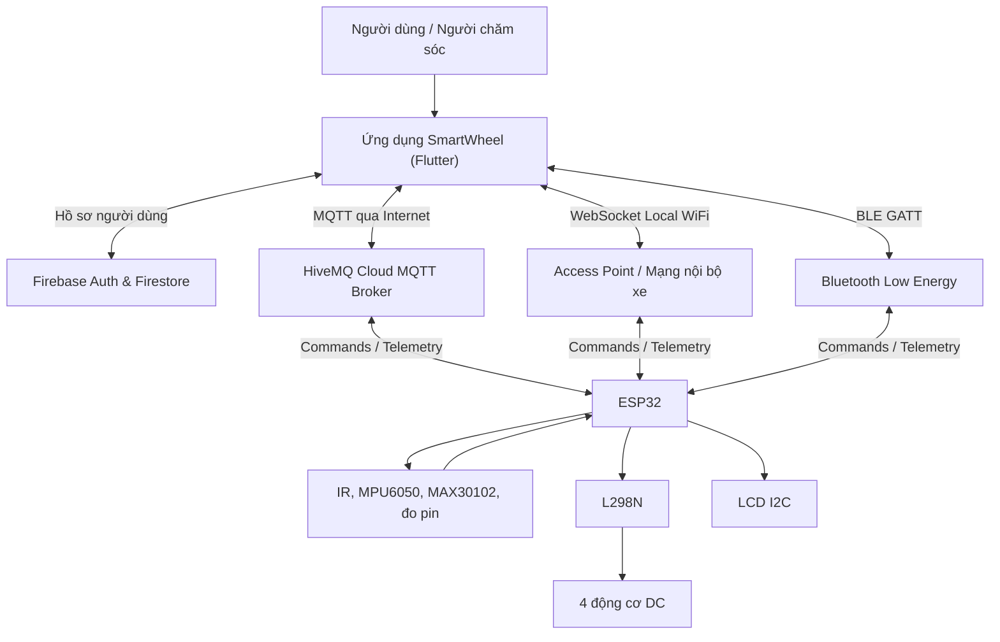
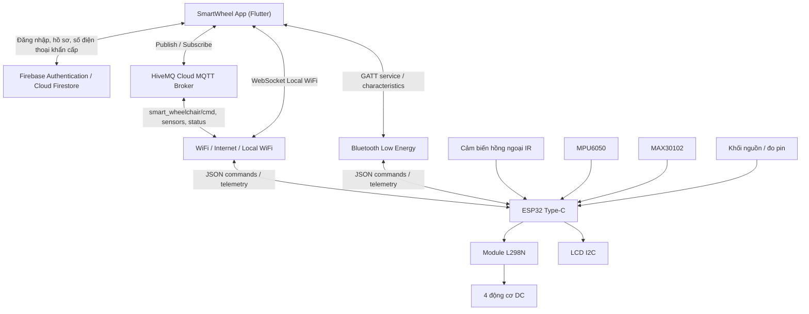
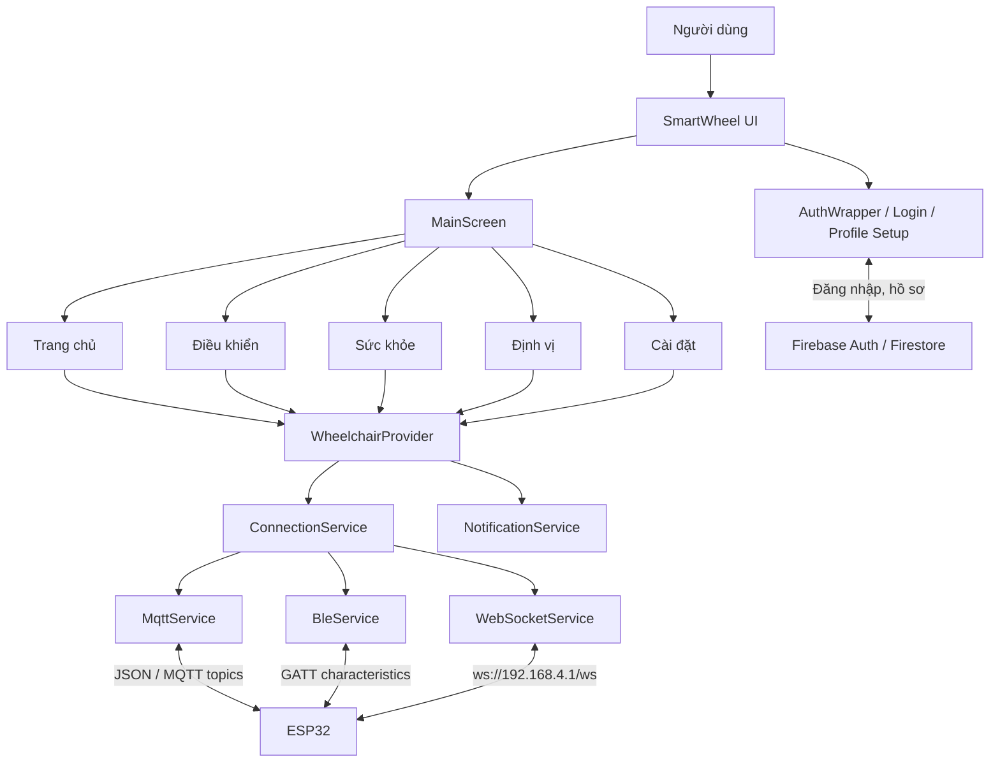

TRƯỜNG ĐẠI HỌC CÔNG NGHỆ KỸ THUẬT TP. HỒ CHÍ MINH
KHOA CÔNG NGHỆ THÔNG TIN
 
BÁO CÁO ĐỀ TÀI:
SMART WHEELCHAIR

MÔN HỌC: VẠN VẬT KẾT NỐI – HỌC KỲ 2 – ĐỢT 2 – NĂM HỌC 2025 - 2026
LỚP HỌC PHẦN: 252INOT231780_06
NHÓM THỰC HIỆN: NHÓM 07
Võ Lê Vương – 24110391
Nguyễn Đức Phát – 24110296
Nông Văn Cường – 24110176

GVHD: ThS. Đinh Công Đoan

TP. Hồ Chí Minh, tháng 6 năm 2026
MỤC LỤC

MỤC LỤC	2
PHẦN MỞ ĐẦU	4
1.	Tóm tắt	4
2.	Đặt vấn đề	4
2.1.	Tóm lược những nghiên cứu trong và ngoài nước liên quan đến đề tài	4
2.2.	Tính cấp thiết cần nghiên cứu của đề tài	4
2.3.	Một số tài liệu có liên quan	4
2.4.	Lý do chọn đề tài	4
2.5.	Mục tiêu đề tài	4
2.6.	Đối tượng và phạm vi nghiên cứu	4
2.7.	Phương pháp nghiên cứu	4
2.8.	Nội dung đề tài	4
PHẦN NỘI DUNG	5
Chương 1: Giới thiệu	5
1.1. Tổng quan ngắn về hệ thống Smart Wheelchair	5
1.2. Thành phần chính của hệ thống	5
1.3. Luồng hoạt động tổng quát	5
Chương 2: Phân tích yêu cầu	6
2.1. Yêu cầu chức năng	6
2.2. Yêu cầu phi chức năng	6
2.3. Sơ đồ nguyên lý hệ thống	6
2.4. Lựa chọn giải pháp	7
Chương 3: Những kiến thức liên quan	7
3.1. Kiến trúc IoT 4 lớp	7
3.2. Vi điều khiển ESP32	7
3.3. Giao thức MQTT	7
3.4. Bluetooth Low Energy	8
3.5. Flutter và Firebase	8
3.6. Cảm biến và cơ cấu chấp hành	8
Chương 4: Ứng dụng	8
4.1. Sơ đồ khối ứng dụng	8
4.2. Thiết kế ứng dụng di động	8
4.3. Thiết kế tầng kết nối	9
4.4. Thiết kế firmware ESP32	9
4.5. Cơ chế an toàn	9
4.6. Kiểm thử hệ thống	10
4.7. Khó khăn và hướng khắc phục trong quá trình xây dựng	10
PHẦN KẾT LUẬN	11
TÀI LIỆU THAM KHẢO	12

 
PHẦN MỞ ĐẦU
1.	Tóm tắt
Đề tài Smart Wheelchair xây dựng mô hình xe lăn thông minh ứng dụng IoT nhằm hỗ trợ người dùng điều khiển xe, theo dõi trạng thái thiết bị và nhận cảnh báo an toàn thông qua ứng dụng di động. Hệ thống gồm ứng dụng SmartWheel phát triển bằng Flutter, vi điều khiển ESP32, tầng kết nối MQTT/BLE/Local WiFi, cảm biến khoảng cách, theo dõi mức pin, dữ liệu sức khỏe và cơ cấu điều khiển động cơ. Ứng dụng cho phép người dùng đăng nhập, thiết lập hồ sơ, chọn phương thức kết nối, gửi lệnh tiến, lùi, rẽ trái, rẽ phải, dừng và quan sát dữ liệu cảm biến theo thời gian gần thực.

Về kiến trúc, hệ thống được tổ chức theo mô hình IoT nhiều lớp: lớp nhận thức gồm ESP32, cảm biến và động cơ; lớp mạng gồm WiFi, MQTT, Bluetooth Low Energy và WebSocket; lớp xử lý gồm MQTT Broker, Firebase Authentication và Cloud Firestore; lớp ứng dụng là giao diện di động cho người dùng. Firmware ESP32 chịu trách nhiệm nhận lệnh JSON, điều khiển động cơ qua module L298N, đọc cảm biến siêu âm HC-SR04, ước lượng mức pin, gửi dữ liệu cảm biến định kỳ và kích hoạt dừng khẩn cấp khi phát hiện vật cản ở khoảng cách nguy hiểm. Cách thiết kế này giúp đề tài kết hợp được điều khiển, giám sát và cơ chế an toàn trong một hệ thống IoT hoàn chỉnh.

Kết quả hướng tới của đề tài là một mô hình xe lăn thông minh có khả năng điều khiển linh hoạt qua nhiều kênh kết nối, có thể hoạt động trong các tình huống mạng khác nhau và cung cấp thông tin trạng thái rõ ràng cho người dùng. Đề tài không chỉ giúp nhóm vận dụng kiến thức về IoT, lập trình nhúng, ứng dụng di động và dịch vụ đám mây, mà còn góp phần tiếp cận bài toán công nghệ hỗ trợ cho người già, người khuyết tật hoặc người gặp khó khăn trong vận động.

2.	Đặt vấn đề
Công nghệ hỗ trợ có vai trò quan trọng trong việc duy trì hoặc cải thiện khả năng hoạt động, tự chăm sóc, giao tiếp và tham gia xã hội của con người. Theo Tổ chức Y tế Thế giới, hơn 2,5 tỷ người trên toàn cầu cần ít nhất một sản phẩm hỗ trợ, và con số này được dự báo có thể tăng lên khoảng 3,5 tỷ người vào năm 2050 do già hóa dân số và sự gia tăng các bệnh không lây nhiễm [1]. Trong nhóm sản phẩm hỗ trợ đó, xe lăn là phương tiện thiết yếu đối với nhiều người bị hạn chế vận động, giúp họ di chuyển, học tập, làm việc và sinh hoạt độc lập hơn.

Nhu cầu về xe lăn phù hợp không chỉ dừng ở việc có một phương tiện di chuyển, mà còn liên quan đến an toàn, khả năng thích ứng với môi trường và sự thuận tiện trong quá trình sử dụng. WHO ước tính khoảng 80 triệu người, tương đương khoảng 1% dân số thế giới, có khả năng cần xe lăn để hỗ trợ di chuyển; nhu cầu này có xu hướng tăng khi dân số già đi và các vấn đề sức khỏe mạn tính phổ biến hơn [3]. Tuy nhiên, xe lăn truyền thống thường phụ thuộc nhiều vào sức người dùng hoặc người chăm sóc, thiếu khả năng cảnh báo vật cản, thiếu giám sát trạng thái và khó mở rộng các chức năng hỗ trợ từ xa.

Sự phát triển của IoT, vi điều khiển giá rẻ, cảm biến, giao thức truyền thông nhẹ và ứng dụng di động mở ra khả năng xây dựng các hệ thống xe lăn thông minh với chi phí phù hợp hơn. Thay vì chỉ điều khiển cơ học, xe lăn có thể được kết nối với điện thoại để gửi lệnh, nhận dữ liệu cảm biến, theo dõi pin, cảnh báo nguy hiểm và lưu trữ thông tin người dùng. Vì vậy, đề tài Smart Wheelchair được lựa chọn nhằm nghiên cứu, thiết kế và xây dựng một mô hình xe lăn thông minh phục vụ mục tiêu học tập, thử nghiệm kỹ thuật IoT và hướng tới ứng dụng hỗ trợ di chuyển an toàn.

2.1.	Tóm lược những nghiên cứu trong và ngoài nước liên quan đến đề tài
Các nghiên cứu về xe lăn thông minh trên thế giới thường tập trung vào ba hướng chính: tăng tính tự chủ trong di chuyển, nâng cao an toàn bằng cảm biến và mở rộng khả năng giám sát qua IoT. Một số công trình xây dựng xe lăn sử dụng nhiều phương thức tương tác người - máy như cần điều khiển, cử chỉ, ứng dụng di động hoặc nền tảng đám mây; dữ liệu cảm biến được gửi lên hệ thống IoT để theo dõi trạng thái và hỗ trợ điều khiển từ xa [4]. Điều này cho thấy xe lăn thông minh không còn là thiết bị cơ khí đơn lẻ, mà đang được phát triển như một hệ thống nhúng kết nối, có khả năng cảm nhận môi trường và trao đổi dữ liệu hai chiều.

Hướng nghiên cứu khác tập trung vào điều khiển bằng cử chỉ, phát hiện té ngã và tránh vật cản. Các hệ thống này thường kết hợp cảm biến khoảng cách, cảm biến gia tốc, xử lý tín hiệu và cảnh báo để giảm rủi ro va chạm hoặc tai nạn trong quá trình sử dụng [5]. Một số nghiên cứu gần đây còn khai thác camera, LiDAR, thuật toán tránh vật cản hoặc trí tuệ nhân tạo để tăng khả năng tự hành, nhưng các giải pháp này thường có chi phí và độ phức tạp cao hơn so với phạm vi một mô hình học phần.

Tại Việt Nam, các đề tài sinh viên và mô hình thực nghiệm về xe lăn thông minh thường lựa chọn hướng tiếp cận chi phí thấp: dùng ESP32 hoặc Arduino làm bộ điều khiển, module L298N để điều khiển động cơ DC, cảm biến siêu âm hoặc hồng ngoại để phát hiện vật cản, Bluetooth/WiFi để giao tiếp với điện thoại. Cách tiếp cận này phù hợp với môi trường học tập vì linh kiện dễ tiếp cận, dễ kiểm thử và thể hiện được đầy đủ các thành phần của hệ thống IoT. Đề tài Smart Wheelchair kế thừa hướng tiếp cận đó, đồng thời mở rộng thêm nhiều kênh kết nối gồm MQTT qua WiFi, BLE trực tiếp và Local WiFi qua WebSocket để tăng tính linh hoạt.

2.2.	Tính cấp thiết cần nghiên cứu của đề tài
Xe lăn là phương tiện hỗ trợ quan trọng đối với người bị suy giảm khả năng vận động, nhưng việc sử dụng xe lăn truyền thống có thể gặp nhiều hạn chế trong không gian hẹp, khi người dùng thiếu sức điều khiển hoặc khi cần người chăm sóc hỗ trợ thường xuyên. Nếu xe lăn không có cơ chế cảnh báo vật cản, theo dõi trạng thái hoặc dừng khẩn cấp, nguy cơ va chạm và mất an toàn có thể tăng lên, đặc biệt với người cao tuổi hoặc người có bệnh nền.

Trong bối cảnh IoT phát triển mạnh, việc nghiên cứu mô hình xe lăn thông minh có tính cấp thiết ở cả khía cạnh xã hội và kỹ thuật. Về xã hội, đề tài tiếp cận nhu cầu cải thiện tính độc lập và an toàn cho nhóm người cần hỗ trợ di chuyển. Về kỹ thuật, đề tài giúp kiểm chứng cách kết hợp vi điều khiển ESP32, cảm biến, điều khiển động cơ, MQTT, BLE, Firebase và ứng dụng Flutter trong một hệ thống có luồng dữ liệu hai chiều. ESP32 phù hợp với các ứng dụng IoT vì tích hợp WiFi, Bluetooth/BLE, GPIO, ADC và PWM, đáp ứng tốt yêu cầu vừa kết nối vừa điều khiển phần cứng [6].

2.3.	Một số tài liệu có liên quan
Các tài liệu nền tảng của đề tài gồm nhóm tài liệu về công nghệ hỗ trợ và xe lăn, nhóm tài liệu về giao thức IoT, nhóm tài liệu về phần cứng ESP32 và nhóm tài liệu về phát triển ứng dụng di động. Tài liệu của WHO cung cấp bối cảnh về nhu cầu công nghệ hỗ trợ và hướng dẫn cung cấp xe lăn phù hợp cho người dùng [1][2]. Đây là cơ sở để xác định ý nghĩa xã hội của đề tài và lý giải vì sao các hệ thống xe lăn cần chú trọng đến an toàn, sự phù hợp và khả năng hỗ trợ người dùng.

Về công nghệ kết nối, MQTT là giao thức truyền thông theo mô hình publish/subscribe, phù hợp với các môi trường IoT cần trao đổi bản tin nhỏ giữa thiết bị, broker và ứng dụng [7]. Bluetooth Low Energy sử dụng mô hình GATT với service và characteristic để thiết bị ngoại vi có thể cho phép thiết bị trung tâm đọc, ghi hoặc nhận thông báo dữ liệu [8]. Trong đề tài, hai công nghệ này được áp dụng tương ứng cho kết nối qua cloud và kết nối trực tiếp gần thiết bị.

Về phần mềm, Flutter cho phép xây dựng ứng dụng đa nền tảng từ một codebase, phù hợp để phát triển giao diện điều khiển và giám sát trên thiết bị di động [9]. Firebase Authentication hỗ trợ xác thực người dùng, còn Cloud Firestore là cơ sở dữ liệu NoSQL dạng tài liệu dùng để lưu và đồng bộ dữ liệu ứng dụng [10]. Các tài liệu này là cơ sở để lựa chọn công nghệ cho ứng dụng SmartWheel.

2.4.	Lý do chọn đề tài
Nhóm chọn đề tài Smart Wheelchair vì đây là bài toán có ý nghĩa thực tiễn, thể hiện rõ đặc trưng của môn Vạn vật kết nối và có phạm vi phù hợp với khả năng triển khai mô hình. Một hệ thống xe lăn thông minh cần có cảm biến, bộ điều khiển, cơ cấu chấp hành, giao thức truyền thông, ứng dụng người dùng và xử lý dữ liệu. Những thành phần này tương ứng trực tiếp với kiến thức IoT đã học, giúp nhóm rèn luyện khả năng thiết kế hệ thống từ phần cứng đến phần mềm.

Ngoài ra, đề tài có tính mở rộng cao. Ở mức cơ bản, xe lăn có thể điều khiển tiến, lùi, trái, phải và dừng. Ở mức nâng cao hơn, hệ thống có thể bổ sung cảnh báo vật cản, theo dõi pin, dữ liệu sức khỏe, định vị, phát hiện té ngã, lưu hồ sơ người dùng và nhiều kênh kết nối dự phòng. Việc lựa chọn Flutter, ESP32, MQTT, BLE và Firebase giúp nhóm xây dựng được một mô hình đủ hoàn chỉnh để kiểm thử nhiều tình huống vận hành khác nhau.

2.5.	Mục tiêu đề tài
Mục tiêu tổng quát của đề tài là thiết kế và xây dựng mô hình Smart Wheelchair có khả năng điều khiển từ ứng dụng di động, thu thập dữ liệu cảm biến và cung cấp cảnh báo an toàn trong quá trình vận hành.

Các mục tiêu cụ thể gồm: xây dựng ứng dụng di động SmartWheel bằng Flutter; tích hợp đăng nhập và lưu hồ sơ người dùng bằng Firebase; thiết kế tầng kết nối có thể chuyển đổi giữa MQTT, BLE và Local WiFi; lập trình firmware ESP32 để nhận lệnh điều khiển, điều khiển động cơ và gửi dữ liệu cảm biến; hiển thị trạng thái pin, khoảng cách vật cản, trạng thái thiết bị và dữ liệu sức khỏe trên ứng dụng; xây dựng cơ chế dừng khẩn cấp khi vật cản ở gần; kiểm thử các chức năng chính trong điều kiện mô hình.

2.6.	Đối tượng và phạm vi nghiên cứu
Đối tượng nghiên cứu của đề tài là mô hình xe lăn thông minh sử dụng vi điều khiển ESP32 làm bộ xử lý trung tâm, ứng dụng di động Flutter làm giao diện điều khiển và các giao thức kết nối IoT để trao đổi dữ liệu giữa người dùng và thiết bị.

Phạm vi nghiên cứu tập trung vào mô hình học phần, không nhằm thay thế thiết bị y tế thương mại hoặc xe lăn đạt chuẩn y tế. Hệ thống được triển khai ở quy mô mô hình với các chức năng chính: điều khiển hướng di chuyển, điều chỉnh tốc độ, giám sát khoảng cách vật cản, mức pin, trạng thái kết nối, dữ liệu sức khỏe mô phỏng hoặc từ cảm biến, cảnh báo bất thường và lưu thông tin hồ sơ người dùng. Các chức năng tự hành hoàn toàn, lập bản đồ môi trường phức tạp, chứng nhận an toàn y tế và sản xuất công nghiệp không thuộc phạm vi của đề tài.

2.7.	Phương pháp nghiên cứu
Đề tài sử dụng phương pháp nghiên cứu kết hợp giữa khảo sát tài liệu, phân tích yêu cầu, thiết kế hệ thống, triển khai mô hình và kiểm thử thực nghiệm. Trước hết, nhóm khảo sát các tài liệu liên quan đến công nghệ hỗ trợ, xe lăn thông minh, MQTT, BLE, ESP32, Flutter và Firebase để xác định nền tảng kỹ thuật phù hợp. Sau đó, nhóm phân tích yêu cầu chức năng và phi chức năng của hệ thống, từ đó xây dựng kiến trúc gồm phần cứng, firmware, ứng dụng di động và dịch vụ đám mây.

Trong quá trình triển khai, nhóm phát triển firmware ESP32 theo Arduino Framework, xây dựng ứng dụng Flutter theo mô hình quản lý trạng thái bằng Provider và thiết kế interface chung `ConnectionService` để hoán đổi các kênh kết nối. Dữ liệu giữa app và ESP32 được chuẩn hóa bằng JSON để dùng chung cho MQTT, BLE và WebSocket. Cuối cùng, nhóm kiểm thử từng chức năng như đăng nhập, kết nối, gửi lệnh điều khiển, đọc dữ liệu cảm biến, cảnh báo vật cản, trạng thái online/offline và khả năng chuyển đổi giữa các phương thức kết nối.

2.8.	Nội dung đề tài
Nội dung đề tài được trình bày theo các phần chính. Phần mở đầu nêu tóm tắt, bối cảnh, tính cấp thiết, lý do chọn đề tài, mục tiêu, phạm vi và phương pháp nghiên cứu. Chương 1 giới thiệu tổng quan hệ thống Smart Wheelchair, các thành phần chính và luồng hoạt động tổng quát. Chương 2 phân tích yêu cầu chức năng, yêu cầu phi chức năng, sơ đồ nguyên lý và lựa chọn giải pháp. Chương 3 trình bày các kiến thức liên quan như kiến trúc IoT 4 lớp, ESP32, MQTT, BLE, Flutter, Firebase, cảm biến và cơ cấu chấp hành. Chương 4 mô tả quá trình thiết kế ứng dụng, tầng kết nối, firmware ESP32, cơ chế an toàn, kiểm thử hệ thống, khó khăn và hướng khắc phục. Phần kết luận tổng hợp kết quả đạt được, ưu nhược điểm và hướng phát triển tiếp theo của đề tài.

 
PHẦN NỘI DUNG
Chương 1: Giới thiệu
1.1. Tổng quan ngắn về hệ thống Smart Wheelchair
Smart Wheelchair là hệ thống xe lăn thông minh ứng dụng IoT nhằm hỗ trợ người dùng bị hạn chế vận động trong quá trình di chuyển, đồng thời giúp người thân hoặc người chăm sóc có thể theo dõi trạng thái thiết bị qua ứng dụng di động. Hệ thống không chỉ tập trung vào chức năng điều khiển xe lăn, mà còn kết hợp giám sát sinh hiệu, cảnh báo an toàn và lưu trữ thông tin người dùng. Cách tiếp cận này phù hợp với vai trò của công nghệ hỗ trợ, vì các sản phẩm hỗ trợ như xe lăn có thể cải thiện khả năng di chuyển, tự chăm sóc, tham gia học tập, làm việc và sinh hoạt xã hội của người dùng [1].

Trong đề tài, xe lăn được xem như một thiết bị IoT hoàn chỉnh gồm phần cứng, firmware, tầng kết nối, dịch vụ đám mây và ứng dụng người dùng. Người dùng tương tác với hệ thống thông qua ứng dụng SmartWheel phát triển bằng Flutter. Ứng dụng cho phép đăng nhập bằng tài khoản Google, lưu hồ sơ cá nhân và số điện thoại khẩn cấp bằng Firebase, chọn phương thức kết nối, gửi lệnh điều khiển và quan sát các dữ liệu như trạng thái kết nối, mức pin, dữ liệu cảm biến, sinh hiệu và cảnh báo bất thường. Việc sử dụng ứng dụng di động giúp hệ thống thuận tiện hơn so với xe lăn truyền thống, vì người dùng hoặc người hỗ trợ có thể thao tác bằng giao diện trực quan thay vì chỉ phụ thuộc vào điều khiển cơ học.

Về mặt kết nối, hệ thống hỗ trợ nhiều phương thức để phù hợp với các tình huống vận hành khác nhau. Khi có Internet, ứng dụng và ESP32 trao đổi dữ liệu thông qua MQTT Broker trên HiveMQ Cloud. Khi cần điều khiển trong mạng nội bộ, ứng dụng có thể kết nối trực tiếp đến xe qua WebSocket Local WiFi. Khi không có hạ tầng mạng, Bluetooth Low Energy được dùng cho kết nối gần giữa điện thoại và ESP32. Thiết kế đa kết nối này giúp hệ thống linh hoạt hơn, giảm phụ thuộc vào một kênh truyền duy nhất và phù hợp với đặc trưng của các hệ thống xe lăn thông minh có nhu cầu điều khiển, giám sát và phản hồi trạng thái theo thời gian gần thực [4][5].

Về mặt an toàn, Smart Wheelchair hướng đến việc giảm rủi ro trong quá trình di chuyển bằng các cảm biến và cơ chế cảnh báo. Cảm biến hồng ngoại được dùng để phát hiện vật cản phía trước hoặc bậc thang nguy hiểm, cảm biến gia tốc/góc nghiêng MPU6050 hỗ trợ phát hiện té ngã, còn cảm biến MAX30102 phục vụ theo dõi nhịp tim và nồng độ oxy trong máu. Các dữ liệu này được xử lý bởi ESP32 và gửi về ứng dụng để hiển thị hoặc kích hoạt cảnh báo. Nhờ đó, hệ thống không chỉ là phương tiện điều khiển từ xa, mà còn là mô hình thử nghiệm cho một nền tảng hỗ trợ di chuyển có khả năng cảm nhận môi trường, phản hồi sự cố và cung cấp thông tin cho người dùng.

1.2. Thành phần chính của hệ thống
Hệ thống Smart Wheelchair gồm bốn nhóm thành phần chính: phần cứng xe lăn, hệ thống cảm biến, tầng kết nối - dịch vụ đám mây và ứng dụng di động.

Nhóm phần cứng xe lăn gồm vi điều khiển ESP32 Type-C, khung xe mica, module điều khiển động cơ L298N, bốn động cơ DC giảm tốc TT Motor, màn hình LCD I2C, pin 18650 và mạch hạ áp. ESP32 đóng vai trò bộ xử lý trung tâm của xe lăn, nhận lệnh từ ứng dụng, đọc dữ liệu cảm biến và xuất tín hiệu điều khiển đến driver động cơ. ESP32 phù hợp với mô hình này vì tích hợp WiFi, Bluetooth/BLE, nhiều chân GPIO, ADC và các khối tạo PWM, đáp ứng đồng thời yêu cầu kết nối mạng, đọc tín hiệu cảm biến và điều khiển cơ cấu chấp hành [6]. Module L298N được dùng để điều khiển chiều quay và tốc độ của các động cơ DC, còn LCD I2C dùng để hiển thị một số thông tin trạng thái hoặc sinh hiệu ngay trên mô hình xe.

Nhóm cảm biến gồm cảm biến hồng ngoại, MPU6050 và MAX30102. Cảm biến hồng ngoại hỗ trợ nhận diện vật cản phía trước hoặc mép bậc thang, từ đó phục vụ cơ chế dừng khẩn cấp. MPU6050 cung cấp dữ liệu gia tốc và góc nghiêng để phát hiện tình huống ngã hoặc lật xe. MAX30102 được dùng để theo dõi nhịp tim và SpO2, giúp bổ sung chức năng giám sát sức khỏe cho người dùng. Trong tầng dữ liệu của ứng dụng, các thông tin cảm biến được biểu diễn theo mô hình `SensorData`, gồm khoảng cách hoặc tín hiệu vật cản, mức pin, nhịp tim, SpO2, vị trí nếu có và thời điểm cập nhật.

Nhóm kết nối và dịch vụ đám mây gồm MQTT, WebSocket Local WiFi, BLE, Firebase Authentication và Cloud Firestore. MQTT sử dụng mô hình publish/subscribe, trong đó ứng dụng gửi lệnh điều khiển đến topic `smart_wheelchair/cmd`, ESP32 gửi dữ liệu cảm biến lên topic `smart_wheelchair/sensors` và gửi trạng thái thiết bị lên topic `smart_wheelchair/status`. Payload giữa các bên được chuẩn hóa bằng JSON, ví dụ lệnh điều khiển có dạng `{"cmd":"forward","speed":200}`. Bluetooth Low Energy sử dụng mô hình GATT với service và characteristic để ứng dụng có thể ghi lệnh điều khiển, nhận dữ liệu cảm biến và đọc hoặc nhận thông báo trạng thái thiết bị [8]. Firebase Authentication phục vụ xác thực người dùng, còn Cloud Firestore lưu hồ sơ cá nhân và số điện thoại khẩn cấp [10].

Nhóm ứng dụng di động là ứng dụng SmartWheel phát triển bằng Flutter. Ứng dụng gồm các màn hình đăng nhập, thiết lập hồ sơ, trang chủ, điều khiển, sức khỏe, điều hướng và cài đặt. Flutter cho phép xây dựng ứng dụng đa nền tảng từ một codebase, phù hợp với yêu cầu triển khai trên thiết bị di động trong phạm vi đề tài [9]. Trong ứng dụng, lớp `WheelchairProvider` quản lý trạng thái thiết bị, dữ liệu cảm biến, loại kết nối hiện tại và lỗi kết nối. Các lớp triển khai `ConnectionService` như MQTT, BLE và WebSocket giúp ứng dụng có thể chuyển đổi phương thức kết nối mà vẫn giữ cùng một cách gửi lệnh và nhận dữ liệu.

1.3. Luồng hoạt động tổng quát
Luồng hoạt động của hệ thống bắt đầu từ phía người dùng. Khi mở ứng dụng, người dùng đăng nhập bằng tài khoản Google hoặc phương thức được hỗ trợ, sau đó ứng dụng kiểm tra hồ sơ cá nhân trên Firestore. Nếu hồ sơ chưa đầy đủ, người dùng được yêu cầu bổ sung thông tin như tuổi và số điện thoại khẩn cấp. Sau khi vào màn hình chính, người dùng chọn phương thức kết nối phù hợp với điều kiện sử dụng: MQTT khi có Internet, Local WiFi/WebSocket khi kết nối trực tiếp vào mạng của xe, hoặc BLE khi cần kết nối gần không phụ thuộc hạ tầng mạng.

Sau khi kết nối thành công, người dùng có thể gửi các lệnh điều khiển như tiến, lùi, rẽ trái, rẽ phải và dừng. Ứng dụng đóng gói lệnh thành JSON và gửi qua kênh đang hoạt động. ESP32 nhận lệnh, kiểm tra trạng thái an toàn rồi điều khiển module L298N để thay đổi chiều quay hoặc tốc độ động cơ. Ở chiều ngược lại, ESP32 đọc dữ liệu cảm biến, mức pin và trạng thái hệ thống, sau đó gửi dữ liệu về ứng dụng qua MQTT, WebSocket hoặc BLE. Ứng dụng nhận dữ liệu, cập nhật giao diện và hiển thị cảnh báo nếu phát hiện pin yếu, vật cản, bậc thang nguy hiểm hoặc dấu hiệu té ngã.

Luồng dữ liệu tổng quát có thể mô tả như sau:

Trong sơ đồ trên, luồng điều khiển đi từ người dùng đến ứng dụng, sau đó đến ESP32 thông qua một trong ba kênh kết nối. Luồng giám sát đi từ cảm biến và ESP32 về ứng dụng để hiển thị theo thời gian gần thực. Luồng cảnh báo được kích hoạt khi dữ liệu cảm biến vượt ngưỡng an toàn hoặc khi phát hiện tình huống bất thường. Luồng đồng bộ hồ sơ đi giữa ứng dụng và Firebase, tách biệt với luồng điều khiển xe để dữ liệu người dùng không phụ thuộc trực tiếp vào kết nối với ESP32.

Chương 2: Phân tích yêu cầu
2.1. Yêu cầu chức năng
Yêu cầu chức năng đầu tiên của hệ thống là xác thực và quản lý hồ sơ người dùng. Ứng dụng cần cho phép người dùng đăng nhập bằng tài khoản Google, theo dõi trạng thái đăng nhập và lưu thông tin cá nhân trên Firebase. Hồ sơ người dùng cần có các thông tin cơ bản như tên hiển thị, email, tuổi và số điện thoại khẩn cấp. Số điện thoại khẩn cấp đặc biệt quan trọng đối với một hệ thống hỗ trợ di chuyển, vì có thể được dùng làm cơ sở cho các chức năng cảnh báo hoặc liên hệ người chăm sóc khi phát hiện sự cố. Firebase Authentication và Cloud Firestore được lựa chọn để hỗ trợ chức năng xác thực và lưu dữ liệu người dùng trên đám mây [10].

Yêu cầu chức năng thứ hai là điều khiển xe lăn từ ứng dụng di động. Người dùng cần có giao diện điều khiển trực quan dạng joystick hoặc D-pad để gửi lệnh tiến, lùi, rẽ trái, rẽ phải và dừng. Hệ thống cũng cần cho phép điều chỉnh tốc độ để phù hợp với môi trường sử dụng, ví dụ di chuyển chậm trong không gian hẹp và nhanh hơn trong khu vực thông thoáng. Các lệnh điều khiển cần được chuẩn hóa dưới dạng JSON để có thể dùng chung trên nhiều kênh kết nối. ESP32 sau khi nhận lệnh phải chuyển đổi thành tín hiệu điều khiển module L298N và bốn động cơ DC.

Yêu cầu chức năng thứ ba là giám sát trạng thái xe và dữ liệu cảm biến. Ứng dụng cần hiển thị trạng thái kết nối, trạng thái online/offline của thiết bị, mức pin, dữ liệu vật cản, dữ liệu sinh hiệu như nhịp tim và SpO2, cùng vị trí nếu hệ thống có dữ liệu tọa độ. Dữ liệu cảm biến phải được cập nhật định kỳ hoặc theo sự kiện để người dùng có thể nắm được tình trạng hiện tại của xe. Trong hệ thống, trạng thái thiết bị được biểu diễn bằng `WheelchairStatus`, còn dữ liệu cảm biến được biểu diễn bằng `SensorData`, giúp tách rõ dữ liệu telemetry và trạng thái kết nối.

Yêu cầu chức năng thứ tư là cảnh báo và đảm bảo an toàn. Khi cảm biến phát hiện vật cản phía trước hoặc bậc thang nguy hiểm, hệ thống cần dừng xe hoặc từ chối lệnh di chuyển có nguy cơ gây va chạm. Khi MPU6050 phát hiện dấu hiệu ngã hoặc lật xe, ứng dụng cần hiển thị cảnh báo và kích hoạt thông báo đến điện thoại. Khi dữ liệu pin xuống thấp hoặc thiết bị mất kết nối, ứng dụng cần cảnh báo để người dùng xử lý kịp thời. Các chức năng này phù hợp với xu hướng nghiên cứu xe lăn thông minh, trong đó cảm biến môi trường, phát hiện té ngã và kết nối IoT được dùng để tăng mức độ an toàn khi vận hành [5].

Yêu cầu chức năng thứ năm là hỗ trợ đa phương thức kết nối. Hệ thống cần cho phép người dùng chọn giữa MQTT, WebSocket Local WiFi và BLE. Chế độ MQTT phục vụ điều khiển và giám sát từ xa khi có Internet. Chế độ WebSocket Local WiFi phục vụ kết nối trực tiếp với xe trong phạm vi mạng nội bộ, ưu tiên độ trễ thấp. Chế độ BLE phục vụ kết nối gần khi không có WiFi hoặc không muốn phụ thuộc vào broker. Việc các kênh kết nối dùng chung cấu trúc lệnh và dữ liệu giúp ứng dụng có thể chuyển đổi phương thức truyền mà không làm thay đổi trải nghiệm điều khiển chính.

Yêu cầu chức năng thứ sáu là điều hướng và cài đặt. Ứng dụng cần có màn hình điều hướng để hiển thị vị trí hoặc hỗ trợ tìm kiếm địa điểm khi có dữ liệu vị trí. Ngoài ra, người dùng cần có khu vực cài đặt để quản lý hồ sơ, cấu hình thông báo, phản hồi rung khi điều khiển và đăng xuất. Các chức năng này không trực tiếp điều khiển động cơ, nhưng giúp hệ thống hoàn chỉnh hơn ở góc độ ứng dụng người dùng.

2.2. Yêu cầu phi chức năng
Yêu cầu phi chức năng quan trọng nhất là an toàn. Vì xe lăn liên quan trực tiếp đến chuyển động của người dùng, hệ thống cần ưu tiên dừng xe khi phát hiện điều kiện nguy hiểm, khi mất kết nối bất thường hoặc khi nhận lệnh không hợp lệ. Các ngưỡng cảnh báo vật cản, pin yếu và sự cố té ngã cần được xử lý theo hướng bảo thủ để giảm rủi ro. Trong phạm vi mô hình học phần, hệ thống không thay thế thiết bị y tế thương mại, nhưng vẫn cần thể hiện nguyên tắc thiết kế lấy an toàn làm ưu tiên.

Yêu cầu tiếp theo là độ trễ thấp và phản hồi rõ ràng. Khi người dùng nhấn nút điều khiển, lệnh cần được gửi nhanh đến ESP32 và trạng thái phản hồi cần được hiển thị rõ trên ứng dụng. MQTT phù hợp với yêu cầu trao đổi bản tin nhỏ trong IoT nhờ mô hình publish/subscribe, giúp tách ứng dụng, broker và thiết bị thành các thành phần độc lập [7]. Với các tình huống cần điều khiển trực tiếp trong phạm vi gần, WebSocket Local WiFi và BLE giúp giảm phụ thuộc vào đường truyền Internet hoặc dịch vụ broker.

Hệ thống cũng cần ổn định và có khả năng hoạt động trong nhiều điều kiện mạng. Nếu có Internet, chế độ MQTT cho phép giám sát từ xa qua broker. Nếu không có Internet nhưng người dùng ở gần xe, BLE hoặc Local WiFi vẫn cho phép tiếp tục điều khiển. Cách thiết kế đa kết nối này làm tăng tính sẵn sàng của hệ thống, đồng thời phù hợp với môi trường sử dụng thực tế, nơi chất lượng WiFi hoặc Internet có thể thay đổi.

Yêu cầu bảo mật được thể hiện ở hai lớp. Ở lớp người dùng, ứng dụng cần xác thực trước khi truy cập hồ sơ và các chức năng chính. Firebase Authentication giúp quản lý phiên đăng nhập, còn Firestore lưu dữ liệu hồ sơ trên nền tảng đám mây [10]. Ở lớp truyền thông IoT, MQTT qua broker có thể sử dụng tài khoản và kết nối TLS, còn BLE giới hạn phạm vi kết nối gần thông qua thiết bị được quét và chọn. Những cơ chế này giúp giảm nguy cơ người không liên quan truy cập hệ thống.

Yêu cầu dễ sử dụng cũng rất quan trọng vì đối tượng hướng đến có thể là người cao tuổi, người khuyết tật hoặc người chăm sóc không chuyên về kỹ thuật. Ứng dụng cần có giao diện rõ ràng, nút điều khiển lớn, trạng thái kết nối dễ nhận biết, cảnh báo dễ hiểu và thao tác kết nối đơn giản. Flutter hỗ trợ xây dựng giao diện di động đa nền tảng, giúp nhóm phát triển một codebase cho nhiều thiết bị và duy trì trải nghiệm nhất quán [9].

Cuối cùng, hệ thống cần có khả năng mở rộng và bảo trì. Việc chuẩn hóa dữ liệu bằng JSON và tách tầng kết nối bằng `ConnectionService` giúp dễ bổ sung phương thức truyền mới hoặc thay đổi backend mà không phải viết lại toàn bộ giao diện. Kiến trúc theo lớp cũng giúp chia rõ trách nhiệm: cảm biến và cơ cấu chấp hành thuộc lớp nhận thức, MQTT/WebSocket/BLE thuộc lớp mạng, Firebase và broker thuộc lớp xử lý, Flutter app thuộc lớp ứng dụng. Cách phân tách này phù hợp với mục tiêu học tập của môn IoT và giúp hệ thống dễ kiểm thử theo từng thành phần.

2.3. Sơ đồ nguyên lý hệ thống
Sơ đồ nguyên lý của hệ thống Smart Wheelchair được xây dựng dựa trên kiến trúc IoT nhiều lớp. Lớp ứng dụng là SmartWheel app phát triển bằng Flutter. Lớp xử lý gồm Firebase và HiveMQ Cloud MQTT Broker. Lớp mạng gồm WiFi cho MQTT/WebSocket và BLE cho kết nối gần. Lớp nhận thức gồm ESP32, các cảm biến, module L298N, động cơ và LCD.

Trong sơ đồ, luồng điều khiển bắt đầu từ ứng dụng và đi đến ESP32 thông qua MQTT, WebSocket hoặc BLE. Khi dùng MQTT, ứng dụng publish lệnh lên broker và ESP32 subscribe topic lệnh để nhận điều khiển. Khi dùng WebSocket hoặc BLE, ứng dụng gửi lệnh trực tiếp đến ESP32. Luồng telemetry đi theo chiều ngược lại, trong đó ESP32 thu thập dữ liệu cảm biến, mức pin và trạng thái thiết bị rồi gửi về ứng dụng để hiển thị.

Luồng cảnh báo được kích hoạt khi cảm biến phát hiện tình huống không an toàn. Cảm biến IR có thể phát hiện vật cản hoặc bậc thang, MPU6050 phát hiện gia tốc/góc nghiêng bất thường, còn dữ liệu sinh hiệu từ MAX30102 giúp ứng dụng hiển thị trạng thái sức khỏe. Khi có sự cố, ESP32 hoặc ứng dụng có thể kích hoạt cảnh báo, dừng động cơ và thông báo cho người dùng. Luồng đồng bộ hồ sơ đi giữa ứng dụng và Firebase, phục vụ quản lý thông tin người dùng và số điện thoại khẩn cấp, không phụ thuộc trực tiếp vào trạng thái kết nối với xe.

2.4. Lựa chọn giải pháp
ESP32 được chọn làm vi điều khiển trung tâm vì phù hợp với các ứng dụng IoT cần vừa kết nối vừa điều khiển phần cứng. So với Arduino Uno, ESP32 có WiFi và Bluetooth/BLE tích hợp, tốc độ xử lý cao hơn, nhiều GPIO hơn và hỗ trợ ADC/PWM tốt hơn cho các bài toán đọc cảm biến và điều khiển động cơ. So với ESP8266, ESP32 có lợi thế ở khả năng Bluetooth/BLE, số lượng ngoại vi phong phú và năng lực xử lý tốt hơn. Những đặc điểm này giúp ESP32 đáp ứng đồng thời yêu cầu điều khiển motor, đọc cảm biến, giao tiếp MQTT, WebSocket và BLE [6].

MQTT được chọn cho chế độ Internet vì đây là giao thức nhẹ, dùng mô hình publish/subscribe và rất phổ biến trong hệ thống IoT. Với MQTT, ứng dụng và ESP32 không cần kết nối trực tiếp với nhau mà giao tiếp thông qua broker. Điều này giúp hệ thống dễ mở rộng, dễ giám sát trạng thái online/offline và phù hợp với luồng dữ liệu hai chiều giữa thiết bị và ứng dụng [7]. Trong đề tài, HiveMQ Cloud đóng vai trò MQTT Broker, còn các topic `smart_wheelchair/cmd`, `smart_wheelchair/sensors` và `smart_wheelchair/status` giúp tách rõ lệnh điều khiển, dữ liệu cảm biến và trạng thái thiết bị.

WebSocket Local WiFi được chọn để phục vụ kết nối trực tiếp trong mạng nội bộ của xe. Khi điện thoại kết nối vào Access Point hoặc mạng local của ESP32, WebSocket cho phép duy trì một phiên truyền hai chiều, phù hợp với nhu cầu điều khiển có độ trễ thấp. Giải pháp này bổ sung cho MQTT vì không phụ thuộc vào Internet hoặc broker, phù hợp với các tình huống thử nghiệm trong phòng học hoặc khi người dùng ở gần xe.

BLE được chọn cho chế độ kết nối gần vì tiêu thụ năng lượng thấp và không yêu cầu hạ tầng WiFi. BLE sử dụng mô hình GATT, trong đó ESP32 hoạt động như peripheral/server, còn ứng dụng di động hoạt động như central/client. Các characteristic có thể được dùng để ghi lệnh điều khiển, nhận thông báo dữ liệu cảm biến và đọc trạng thái thiết bị [8]. Vì vậy, BLE là kênh dự phòng hợp lý khi xe hoạt động ở khoảng cách gần hoặc khi WiFi không ổn định.

Flutter được chọn để phát triển ứng dụng di động vì cho phép xây dựng giao diện Android/iOS từ một codebase, giảm thời gian phát triển và giúp giao diện nhất quán giữa các nền tảng [9]. Firebase được chọn cho backend vì cung cấp sẵn Authentication và Cloud Firestore, phù hợp với yêu cầu đăng nhập, lưu hồ sơ người dùng và đồng bộ dữ liệu cơ bản trên đám mây [10]. Hai công nghệ này giúp nhóm tập trung nhiều hơn vào luồng IoT, điều khiển và giám sát thay vì phải xây dựng toàn bộ backend từ đầu.

JSON được chọn làm định dạng dữ liệu chung giữa ứng dụng và ESP32 vì dễ đọc, dễ kiểm thử và được hỗ trợ tốt trong cả Dart lẫn C/C++ trên ESP32. Việc dùng cùng một cấu trúc payload cho MQTT, WebSocket và BLE giúp hệ thống thống nhất ở tầng dữ liệu. Khi cần bổ sung trường mới như nhịp tim, SpO2, vị trí hoặc trạng thái cảnh báo, nhóm có thể mở rộng JSON mà không phải thay đổi toàn bộ cơ chế truyền thông.

Tổng thể, giải pháp được lựa chọn phù hợp với kiến trúc IoT bốn lớp: lớp nhận thức gồm ESP32, cảm biến và cơ cấu chấp hành; lớp mạng gồm WiFi, MQTT, WebSocket và BLE; lớp xử lý gồm MQTT Broker và Firebase; lớp ứng dụng là SmartWheel app. Cách tổ chức này cân bằng giữa chi phí, khả năng triển khai trong phạm vi học phần, tính an toàn và khả năng mở rộng trong tương lai.

Chương 3: Những kiến thức liên quan
3.1. Kiến trúc IoT 4 lớp
Kiến trúc IoT thường được mô tả theo nhiều mô hình khác nhau, trong đó mô hình bốn lớp là cách tiếp cận phù hợp để phân tích các hệ thống có thiết bị cảm biến, kết nối mạng, xử lý dữ liệu và ứng dụng người dùng. Bốn lớp thường gồm lớp nhận thức, lớp mạng, lớp xử lý hoặc middleware và lớp ứng dụng. Cách phân lớp này giúp tách rõ trách nhiệm của từng thành phần, từ việc thu thập dữ liệu vật lý đến truyền dữ liệu, xử lý thông tin và cung cấp dịch vụ cuối cho người dùng [11].

Lớp nhận thức là lớp gần nhất với môi trường vật lý. Lớp này bao gồm các cảm biến, vi điều khiển, cơ cấu chấp hành và các thiết bị đầu cuối có khả năng cảm nhận hoặc tác động đến môi trường. Trong đề tài Smart Wheelchair, lớp nhận thức gồm ESP32, cảm biến hồng ngoại, MPU6050, MAX30102, khối đo pin, module L298N, bốn động cơ DC và LCD I2C. Các cảm biến tạo ra dữ liệu về vật cản, trạng thái nghiêng, sinh hiệu hoặc nguồn điện; các cơ cấu chấp hành thực hiện lệnh điều khiển như tiến, lùi, rẽ hoặc dừng.

Lớp mạng chịu trách nhiệm truyền dữ liệu giữa thiết bị và các hệ thống xử lý phía trên. Với Smart Wheelchair, lớp mạng gồm WiFi, MQTT, WebSocket Local WiFi và Bluetooth Low Energy. MQTT phục vụ truyền dữ liệu qua Internet thông qua broker, WebSocket phục vụ kết nối trực tiếp trong mạng nội bộ của xe, còn BLE phục vụ kết nối gần giữa điện thoại và ESP32. Việc có nhiều kênh truyền giúp hệ thống hoạt động linh hoạt hơn trong các điều kiện mạng khác nhau.

Lớp xử lý hoặc middleware là nơi tiếp nhận, định tuyến, lưu trữ hoặc quản lý dữ liệu trước khi dữ liệu được sử dụng bởi ứng dụng. Trong đề tài, HiveMQ Cloud MQTT Broker đóng vai trò trung gian định tuyến bản tin giữa ứng dụng và ESP32, còn Firebase Authentication và Cloud Firestore chịu trách nhiệm xác thực người dùng và lưu hồ sơ cá nhân. Lớp này giúp tách ứng dụng khỏi thiết bị phần cứng, đồng thời hỗ trợ quản lý trạng thái và dữ liệu người dùng trên nền tảng đám mây.

Lớp ứng dụng là nơi người dùng trực tiếp tương tác với hệ thống. Đối với Smart Wheelchair, lớp ứng dụng là app SmartWheel phát triển bằng Flutter. Ứng dụng cung cấp giao diện đăng nhập, thiết lập hồ sơ, điều khiển xe, xem trạng thái kết nối, theo dõi sinh hiệu, quan sát dữ liệu cảm biến và nhận cảnh báo. Nhờ cách tổ chức theo bốn lớp, hệ thống có cấu trúc rõ ràng, dễ phân tích, dễ kiểm thử và có khả năng mở rộng thêm cảm biến hoặc kênh kết nối mới trong tương lai.

3.2. Vi điều khiển ESP32
ESP32 là dòng vi điều khiển SoC do Espressif Systems phát triển, được sử dụng rộng rãi trong các ứng dụng IoT nhờ tích hợp WiFi, Bluetooth/BLE, bộ xử lý hiệu năng cao và nhiều ngoại vi phần cứng. Theo tài liệu của Espressif, ESP32 hỗ trợ vi xử lý Xtensa 32-bit, kết nối WiFi, Bluetooth, GPIO, ADC, DAC, UART, SPI, I2C, LED PWM và nhiều khối ngoại vi khác [6]. Những đặc điểm này giúp ESP32 phù hợp với các hệ thống nhúng cần vừa kết nối mạng vừa điều khiển cảm biến và cơ cấu chấp hành.

Trong Smart Wheelchair, ESP32 đảm nhiệm vai trò bộ điều khiển trung tâm ở lớp nhận thức. ESP32 nhận lệnh từ ứng dụng qua MQTT, WebSocket hoặc BLE, giải mã payload JSON, kiểm tra điều kiện an toàn và điều khiển module L298N để thay đổi chuyển động của xe. Đồng thời, ESP32 đọc dữ liệu cảm biến, mức pin và trạng thái hệ thống để gửi về ứng dụng. Nhờ khả năng xử lý và kết nối tích hợp, ESP32 giúp giảm số lượng module phụ so với các vi điều khiển không có WiFi/Bluetooth tích hợp.

Một lợi thế quan trọng của ESP32 trong đề tài là khả năng điều khiển PWM. Động cơ DC cần thay đổi tốc độ bằng cách điều chỉnh độ rộng xung, trong khi L298N cần các tín hiệu điều khiển chiều quay. ESP32 có thể xuất tín hiệu số cho các chân điều khiển chiều và tín hiệu PWM cho chân điều khiển tốc độ, từ đó đáp ứng yêu cầu tiến, lùi, rẽ trái, rẽ phải và dừng. Ngoài ra, ESP32 có ADC để đọc mức điện áp pin, giúp ứng dụng có thể hiển thị hoặc cảnh báo khi nguồn yếu.

ESP32 cũng hỗ trợ tốt cho thiết kế đa kết nối. Khi có WiFi, thiết bị có thể kết nối MQTT Broker để trao đổi dữ liệu qua Internet. Khi cần kết nối gần, ESP32 có thể đóng vai trò BLE peripheral để app ghi lệnh hoặc nhận thông báo dữ liệu. Nếu triển khai Local WiFi, ESP32 có thể cung cấp hoặc tham gia mạng nội bộ để ứng dụng kết nối trực tiếp qua WebSocket. Vì vậy, ESP32 là lựa chọn hợp lý cho mô hình xe lăn thông minh trong phạm vi học phần IoT.

3.3. Giao thức MQTT
MQTT là giao thức truyền thông nhẹ được thiết kế theo mô hình publish/subscribe. Thay vì client gửi dữ liệu trực tiếp cho nhau, các client publish bản tin lên một topic tại broker, còn các client quan tâm đến topic đó sẽ subscribe để nhận dữ liệu. Theo tiêu chuẩn MQTT 5.0 của OASIS, giao thức này được tổ chức quanh các gói tin như CONNECT, PUBLISH, SUBSCRIBE, UNSUBSCRIBE, PINGREQ và DISCONNECT, giúp duy trì phiên kết nối và trao đổi bản tin giữa client và server/broker [7].

Trong hệ thống IoT, MQTT phù hợp vì bản tin nhỏ, mô hình truyền linh hoạt và khả năng tách rời thiết bị gửi với thiết bị nhận. Đối với Smart Wheelchair, ứng dụng Flutter và ESP32 không cần kết nối trực tiếp qua cùng một địa chỉ mạng công khai. Cả hai chỉ cần kết nối đến HiveMQ Cloud MQTT Broker. Khi người dùng điều khiển xe, ứng dụng publish lệnh lên topic lệnh; ESP32 subscribe topic đó để nhận và xử lý. Khi ESP32 có dữ liệu cảm biến hoặc trạng thái, thiết bị publish lên các topic tương ứng; ứng dụng subscribe để nhận và cập nhật giao diện.

Trong đề tài, cấu trúc topic được thiết kế đơn giản và rõ nghĩa. Topic `smart_wheelchair/cmd` dùng cho lệnh điều khiển từ ứng dụng đến ESP32. Topic `smart_wheelchair/sensors` dùng cho dữ liệu cảm biến từ ESP32 gửi về ứng dụng. Topic `smart_wheelchair/status` dùng cho trạng thái online/offline hoặc trạng thái kết nối của thiết bị. Cách tách topic này giúp phân loại dữ liệu theo chức năng, giảm nhầm lẫn khi xử lý và thuận tiện cho việc mở rộng thêm topic mới nếu hệ thống cần lưu lịch sử, cảnh báo hoặc dữ liệu sức khỏe riêng.

Payload MQTT trong đề tài được chuẩn hóa bằng JSON. Lệnh điều khiển có dạng `{"cmd":"forward","speed":200}`, trong đó `cmd` thể hiện hướng di chuyển và `speed` thể hiện giá trị tốc độ PWM. Dữ liệu cảm biến có thể gồm các trường như `distance`, `battery`, `heartRate`, `spo2`, `latitude`, `longitude` và `timestamp`. JSON giúp dữ liệu dễ đọc, dễ debug trên Serial Monitor hoặc MQTT client, đồng thời có thể được parse thuận tiện trong cả firmware C/C++ và ứng dụng Dart.

Một khái niệm quan trọng khác của MQTT là trạng thái phiên và Last Will and Testament. LWT cho phép broker tự động publish một bản tin khi client mất kết nối bất thường, từ đó các client khác có thể biết thiết bị đã offline. Trong Smart Wheelchair, topic trạng thái có thể dùng để thông báo thiết bị đang kết nối hoặc đã mất kết nối. Đây là cơ chế hữu ích đối với hệ thống điều khiển xe lăn, vì trạng thái kết nối cần được hiển thị rõ để người dùng tránh gửi lệnh khi thiết bị không sẵn sàng.

3.4. Bluetooth Low Energy
Bluetooth Low Energy là công nghệ truyền thông không dây khoảng cách gần, được thiết kế cho các thiết bị cần tiêu thụ năng lượng thấp. BLE sử dụng mô hình GATT, trong đó dữ liệu được tổ chức thành service và characteristic. Một thiết bị có thể đóng vai trò peripheral/server để cung cấp service, còn thiết bị khác đóng vai trò central/client để quét, kết nối, đọc, ghi hoặc nhận thông báo từ các characteristic [8].

Trong Smart Wheelchair, ESP32 hoạt động như BLE peripheral, còn ứng dụng di động hoạt động như BLE central. ESP32 quảng bá tên thiết bị để ứng dụng có thể quét và lọc đúng xe lăn cần kết nối. Sau khi kết nối, ứng dụng tìm service chính của Smart Wheelchair và sử dụng các characteristic để trao đổi dữ liệu. Characteristic lệnh cho phép ứng dụng ghi payload JSON xuống ESP32, characteristic cảm biến cho phép ESP32 notify dữ liệu telemetry, còn characteristic trạng thái cho phép ứng dụng đọc hoặc nhận thông báo trạng thái thiết bị.

BLE phù hợp với đề tài vì không phụ thuộc vào Internet hoặc MQTT Broker. Khi người dùng ở gần xe, điện thoại có thể kết nối trực tiếp đến ESP32 và gửi lệnh điều khiển trong phạm vi Bluetooth. Điều này đặc biệt hữu ích trong các tình huống thử nghiệm, khi WiFi không ổn định hoặc khi người dùng chỉ cần điều khiển xe trong khoảng cách gần. BLE cũng là kênh dự phòng cho chế độ MQTT, giúp tăng tính linh hoạt của hệ thống.

Tuy nhiên, BLE có phạm vi và băng thông hạn chế hơn so với WiFi. Vì vậy, trong đề tài, BLE phù hợp nhất cho các payload nhỏ như lệnh điều khiển, trạng thái thiết bị và dữ liệu cảm biến định kỳ. Các dữ liệu lớn hoặc yêu cầu truy cập từ xa qua Internet nên ưu tiên MQTT hoặc các dịch vụ đám mây. Việc kết hợp BLE với MQTT và WebSocket giúp hệ thống tận dụng ưu điểm của từng kênh truyền thay vì phụ thuộc vào một công nghệ duy nhất.

3.5. Flutter và Firebase
Flutter là framework phát triển ứng dụng do Google cung cấp, cho phép xây dựng ứng dụng đa nền tảng từ một codebase. Flutter sử dụng ngôn ngữ Dart và hệ thống widget để mô tả giao diện, tương tác và trạng thái ứng dụng. Theo tài liệu Flutter, framework này hỗ trợ xây dựng ứng dụng cho nhiều màn hình và nền tảng khác nhau, phù hợp với các dự án cần giao diện di động nhất quán và thời gian phát triển ngắn [9].

Trong đề tài Smart Wheelchair, Flutter được dùng để xây dựng ứng dụng SmartWheel. Ứng dụng gồm các màn hình chính như đăng nhập, thiết lập hồ sơ, trang chủ, điều khiển, sức khỏe, điều hướng và cài đặt. Giao diện điều khiển dùng D-pad hoặc joystick để gửi lệnh tiến, lùi, rẽ trái, rẽ phải và dừng. Các màn hình giám sát hiển thị trạng thái kết nối, mức pin, dữ liệu cảm biến, sinh hiệu và cảnh báo. Flutter phù hợp với các yêu cầu này vì có thể xây dựng giao diện phản hồi nhanh, quản lý nhiều màn hình và tích hợp tốt với các plugin như MQTT client, BLE, Firebase, thông báo cục bộ và bản đồ.

Firebase là nền tảng backend của Google, cung cấp nhiều dịch vụ cho ứng dụng như xác thực, cơ sở dữ liệu, lưu trữ và thông báo. Trong đề tài, hai dịch vụ chính là Firebase Authentication và Cloud Firestore. Firebase Authentication hỗ trợ quản lý đăng nhập người dùng, còn Cloud Firestore là cơ sở dữ liệu NoSQL dạng tài liệu, phù hợp để lưu hồ sơ cá nhân, thông tin liên hệ khẩn cấp và các dữ liệu người dùng cần đồng bộ [10].

Việc kết hợp Flutter và Firebase giúp nhóm triển khai nhanh tầng ứng dụng và backend mà không phải xây dựng server riêng. Người dùng có thể đăng nhập, tạo hồ sơ và tiếp tục sử dụng ứng dụng trên thiết bị di động. Dữ liệu hồ sơ được tách khỏi dữ liệu điều khiển xe, nhờ đó việc quản lý người dùng không ảnh hưởng trực tiếp đến luồng điều khiển ESP32. Đây là cách tổ chức hợp lý vì dữ liệu tài khoản cần được xử lý bởi dịch vụ backend, còn lệnh điều khiển và dữ liệu cảm biến cần đi qua các kênh IoT có độ trễ thấp.

Trong kiến trúc phần mềm của ứng dụng, Provider được dùng để quản lý trạng thái xe lăn và cập nhật giao diện khi dữ liệu thay đổi. `WheelchairProvider` lắng nghe các stream từ tầng kết nối, lưu dữ liệu mới nhất và thông báo cho UI. `ConnectionService` đóng vai trò interface chung cho MQTT, BLE và WebSocket, giúp ứng dụng có thể thay đổi phương thức kết nối mà không thay đổi logic điều khiển ở giao diện. Cách thiết kế này giúp app dễ bảo trì và phù hợp với hệ thống có nhiều kênh truyền.

3.6. Cảm biến và cơ cấu chấp hành
Cảm biến là thành phần giúp hệ thống nhận biết trạng thái môi trường, trạng thái người dùng và trạng thái thiết bị. Trong Smart Wheelchair, cảm biến hồng ngoại được dùng để phát hiện vật cản hoặc bậc thang, MPU6050 dùng để phát hiện góc nghiêng hoặc gia tốc bất thường, MAX30102 dùng để theo dõi nhịp tim và SpO2, còn khối đo pin giúp ước lượng mức năng lượng còn lại. Các dữ liệu này là đầu vào quan trọng cho chức năng giám sát và cảnh báo an toàn.

Cảm biến hồng ngoại hoạt động dựa trên việc phát và nhận tín hiệu ánh sáng hồng ngoại để nhận biết sự hiện diện của vật cản hoặc sự thay đổi bề mặt phía trước xe. Trong mô hình xe lăn, cảm biến này có thể dùng để phát hiện vật cản gần hoặc mép bậc thang, từ đó yêu cầu ESP32 dừng động cơ hoặc từ chối lệnh di chuyển nguy hiểm. Đây là một cơ chế đơn giản, chi phí thấp và phù hợp với mô hình học phần.

MPU6050 là cảm biến tích hợp gia tốc kế và con quay hồi chuyển, thường được dùng để đo gia tốc, góc nghiêng và chuyển động của thiết bị. Đối với xe lăn thông minh, dữ liệu từ MPU6050 có thể hỗ trợ nhận diện tình huống xe bị nghiêng quá mức, va chạm mạnh hoặc có dấu hiệu ngã/lật. Khi phát hiện bất thường, hệ thống có thể kích hoạt cảnh báo trên ứng dụng hoặc gửi thông báo đến người chăm sóc.

MAX30102 là cảm biến quang học dùng để đo nhịp tim và độ bão hòa oxy trong máu. Trong Smart Wheelchair, cảm biến này bổ sung chức năng theo dõi sức khỏe cho người dùng, giúp ứng dụng hiển thị các chỉ số sinh hiệu cơ bản bên cạnh trạng thái thiết bị. Dữ liệu nhịp tim và SpO2 không trực tiếp điều khiển chuyển động của xe, nhưng giúp hệ thống mở rộng từ bài toán điều khiển phương tiện sang bài toán hỗ trợ và giám sát người dùng.

Cơ cấu chấp hành chính của hệ thống là bốn động cơ DC giảm tốc được điều khiển thông qua module L298N. L298N nhận tín hiệu điều khiển từ ESP32 để quyết định chiều quay và tốc độ của động cơ. Khi hai bên động cơ quay cùng chiều, xe có thể tiến hoặc lùi; khi tốc độ hoặc trạng thái quay giữa hai bên khác nhau, xe có thể rẽ trái hoặc rẽ phải. Việc kết hợp tín hiệu chiều và PWM giúp hệ thống điều khiển chuyển động linh hoạt hơn.

LCD I2C là thành phần hiển thị tại chỗ, giúp người dùng hoặc nhóm kiểm thử quan sát nhanh một số thông tin như trạng thái hệ thống, kết nối hoặc sinh hiệu. So với việc chỉ hiển thị dữ liệu trên ứng dụng, LCD giúp mô hình trực quan hơn khi trình bày, kiểm thử hoặc vận hành không có điện thoại ở gần. Khối nguồn gồm pin 18650 và mạch hạ áp cung cấp năng lượng cho ESP32, cảm biến, driver và động cơ. Vì động cơ tiêu thụ dòng lớn hơn vi điều khiển, thiết kế nguồn cần đảm bảo điện áp ổn định cho cả logic điều khiển và tải công suất.

Tổng thể, cảm biến và cơ cấu chấp hành tạo nên vòng lặp điều khiển của Smart Wheelchair. Cảm biến cung cấp dữ liệu về môi trường và người dùng; ESP32 xử lý dữ liệu và nhận lệnh từ ứng dụng; module L298N và động cơ thực hiện chuyển động; ứng dụng hiển thị trạng thái và cảnh báo. Vòng lặp này là đặc trưng của hệ thống IoT có tương tác với thế giới vật lý, trong đó dữ liệu cảm nhận và hành động điều khiển được kết nối thông qua mạng và phần mềm.

Chương 4: Ứng dụng
4.1. Sơ đồ khối ứng dụng
Ứng dụng SmartWheel được thiết kế theo hướng tách lớp giữa giao diện người dùng, quản lý trạng thái, tầng kết nối và dịch vụ nền. Cách tổ chức này giúp giao diện không phụ thuộc trực tiếp vào chi tiết MQTT, BLE hoặc WebSocket; thay vào đó, giao diện chỉ làm việc với `WheelchairProvider`. Provider tiếp nhận dữ liệu từ các service kết nối, lưu trạng thái mới nhất và thông báo cho các màn hình cập nhật lại giao diện.

Sơ đồ khối tổng quát của ứng dụng như sau:

Trong sơ đồ trên, `AuthWrapper` kiểm tra trạng thái đăng nhập và điều hướng người dùng đến màn hình đăng nhập, màn hình thiết lập hồ sơ hoặc màn hình chính. Sau khi người dùng vào `MainScreen`, ứng dụng hiển thị năm tab chính gồm Trang chủ, Điều khiển, Sức khỏe, Định vị và Cài đặt. Các tab này cùng đọc dữ liệu từ `WheelchairProvider`, nhờ đó trạng thái kết nối, dữ liệu cảm biến và cảnh báo được đồng bộ trên toàn ứng dụng.

Tầng kết nối được gom sau interface `ConnectionService`. Interface này định nghĩa các thao tác chung như kết nối, ngắt kết nối, gửi lệnh, nhận stream dữ liệu cảm biến, nhận stream trạng thái thiết bị và nhận stream trạng thái kết nối. Ba service cụ thể gồm `MqttService`, `BleService` và `WebSocketService` cùng tuân theo interface này. Vì vậy, khi người dùng chuyển từ MQTT sang BLE hoặc Local WiFi, tầng giao diện không cần thay đổi cách gửi lệnh.

4.2. Thiết kế ứng dụng di động
Ứng dụng di động được phát triển bằng Flutter, sử dụng Material UI, Provider để quản lý trạng thái và Firebase để xác thực người dùng. Khi ứng dụng khởi động, hàm `main()` khởi tạo notification service, nạp biến môi trường và khởi tạo Firebase. Sau đó, widget gốc `SmartWheelchairApp` tạo `WheelchairProvider` bằng `MultiProvider` và hiển thị `AuthWrapper`. Cách khởi tạo này đảm bảo các màn hình bên dưới có thể truy cập trạng thái xe lăn thông qua Provider.

Luồng xác thực bắt đầu tại `AuthWrapper`. Nếu người dùng chưa đăng nhập, ứng dụng hiển thị `LoginScreen`. Nếu đã đăng nhập, ứng dụng kiểm tra hồ sơ trên Firestore. Khi hồ sơ chưa có đủ tuổi hoặc số điện thoại khẩn cấp, ứng dụng điều hướng đến `ProfileSetupScreen`; khi hồ sơ đã đầy đủ, ứng dụng chuyển đến `MainScreen`. Cách kiểm tra này giúp hệ thống đảm bảo thông tin liên hệ khẩn cấp luôn được thiết lập trước khi người dùng sử dụng các chức năng chính.

`MainScreen` là màn hình chứa năm tab chính và thanh điều hướng dưới dạng floating bottom navigation. Các tab được đặt trong `IndexedStack`, giúp giữ trạng thái của từng tab khi người dùng chuyển màn hình. Tab Trang chủ hiển thị lời chào, trạng thái kết nối, thông tin tổng quan và các lối tắt nhanh. Tab Điều khiển cung cấp giao diện D-pad để gửi lệnh tiến, lùi, rẽ trái, rẽ phải và dừng. Tab Sức khỏe hiển thị cảnh báo té ngã, nhịp tim và SpO2. Tab Định vị phục vụ hiển thị vị trí hoặc bản đồ khi có quyền và dữ liệu vị trí. Tab Cài đặt cho phép cấu hình hồ sơ, thông báo, phản hồi rung và các tùy chọn cá nhân.

Giao diện điều khiển được thiết kế theo hướng dễ thao tác trên màn hình cảm ứng. Người dùng có thể nhấn giữ các nút hướng để gửi lệnh di chuyển và thả ra để gửi lệnh dừng. Tốc độ được quy đổi thành giá trị PWM trước khi gửi xuống ESP32. Ứng dụng cũng hỗ trợ phản hồi rung nếu người dùng bật tùy chọn haptic feedback, giúp thao tác điều khiển có phản hồi vật lý rõ hơn.

Ứng dụng có cơ chế cảnh báo ở tầng giao diện. `MainScreen` lắng nghe thay đổi từ `WheelchairProvider`; nếu phát hiện trạng thái té ngã, ứng dụng hiển thị hộp thoại cảnh báo và có thể phát local notification. Nếu dữ liệu cảm biến cho thấy pin yếu, ứng dụng hiển thị cảnh báo dạng snackbar và notification. Các cảnh báo này giúp người dùng nhận biết sự cố ngay cả khi không ở đúng tab giám sát.

4.3. Thiết kế tầng kết nối
Tầng kết nối của SmartWheel được thiết kế theo mẫu Strategy thông qua interface `ConnectionService`. Interface này quy định các chức năng chung cho mọi kênh kết nối: `connect()`, `disconnect()`, `sendCommand()`, `sensorStream`, `statusStream`, `connectionStream`, `connectionState` và `dispose()`. Nhờ đó, `WheelchairProvider` không cần biết chi tiết cách MQTT publish bản tin, BLE ghi characteristic hay WebSocket gửi frame dữ liệu. Provider chỉ gọi `sendCommand()` trên service đang hoạt động và lắng nghe các stream trả về.

`WheelchairProvider` là lớp trung tâm điều phối kết nối. Khi người dùng chọn MQTT, provider tạo `MqttService`, đăng ký lắng nghe stream và gọi kết nối broker. Khi người dùng chọn BLE, provider nhận thiết bị Bluetooth đã quét được, tạo `BleService`, gán thiết bị và kết nối. Khi người dùng chọn Local WiFi, provider tạo `WebSocketService` và kết nối đến địa chỉ mặc định `ws://192.168.4.1/ws`. Nếu kết nối thất bại, provider cập nhật thông báo lỗi để giao diện hiển thị cho người dùng.

Với MQTT, ứng dụng dùng HiveMQ Cloud Broker và các topic đã thống nhất với firmware: `smart_wheelchair/cmd`, `smart_wheelchair/sensors` và `smart_wheelchair/status`. Khi gửi lệnh, app publish payload JSON gồm `cmd` và `speed` lên topic lệnh. Khi nhận dữ liệu, service parse JSON thành `SensorData` hoặc `WheelchairStatus`. Mô hình publish/subscribe của MQTT phù hợp với chế độ Internet vì ứng dụng và ESP32 không cần kết nối trực tiếp với nhau [7].

Với BLE, ESP32 hoạt động như GATT server, còn ứng dụng là GATT client. App quét các thiết bị có tên bắt đầu bằng `SmartWheelchair`, sau đó kết nối và tìm đúng service UUID. Characteristic cảm biến dùng notify để đẩy dữ liệu từ ESP32 về app, characteristic command dùng write để app gửi lệnh xuống ESP32, còn characteristic status dùng read/notify để cập nhật trạng thái thiết bị. Cách tổ chức này bám theo mô hình service/characteristic của GATT [8].

Với WebSocket Local WiFi, app kết nối trực tiếp đến endpoint `ws://192.168.4.1/ws`. Kênh này được thiết kế cho trường hợp điện thoại kết nối vào mạng nội bộ hoặc Access Point của xe lăn. Payload vẫn là JSON giống MQTT và BLE, nên app giữ được cùng cấu trúc lệnh. Dù firmware hiện tại tập trung nhiều vào MQTT và BLE, tầng ứng dụng đã có `WebSocketService` để chuẩn bị cho chế độ Local WiFi.

Nhìn chung, điểm quan trọng của tầng kết nối là thống nhất dữ liệu. Cùng một lệnh như `forward`, `backward`, `left`, `right`, `stop` và cùng một cấu trúc dữ liệu như `distance`, `battery`, `heartRate`, `spo2`, `latitude`, `longitude`, `timestamp` có thể đi qua nhiều kênh truyền. Điều này giúp hệ thống dễ mở rộng, dễ kiểm thử và giảm trùng lặp logic xử lý ở tầng giao diện.

4.4. Thiết kế firmware ESP32
Firmware ESP32 được xây dựng bằng C/C++ theo Arduino Framework. Nhiệm vụ chính của firmware là khởi tạo kết nối, nhận lệnh điều khiển, điều khiển động cơ, đọc cảm biến, gửi dữ liệu telemetry và thực hiện cơ chế an toàn. Firmware sử dụng các thư viện như `WiFi`, `WiFiClientSecure`, `PubSubClient`, `ArduinoJson` và BLE để triển khai giao tiếp MQTT và Bluetooth Low Energy.

Trong giai đoạn khởi động, firmware thực hiện các bước chính: khởi tạo Serial để debug, khởi tạo BLE server, kết nối WiFi, cấu hình MQTT broker, cấu hình chân điều khiển L298N, cấu hình PWM, cấu hình chân cảm biến và dừng động cơ để đảm bảo trạng thái ban đầu an toàn. BLE được khởi tạo trước WiFi để thiết bị vẫn có thể sẵn sàng cho kết nối gần ngay cả khi WiFi chưa kết nối thành công.

Firmware định nghĩa ba topic MQTT chính. Topic `smart_wheelchair/cmd` nhận lệnh từ ứng dụng. Topic `smart_wheelchair/sensors` gửi dữ liệu cảm biến từ ESP32 về ứng dụng. Topic `smart_wheelchair/status` gửi trạng thái online/offline của thiết bị và được dùng cùng cơ chế LWT để thông báo khi thiết bị mất kết nối bất thường. Payload được mã hóa bằng JSON để thống nhất với ứng dụng Flutter.

Phần xử lý lệnh tập trung trong hàm `handleCommand()`. Hàm này nhận chuỗi JSON, parse bằng ArduinoJson, lấy trường `cmd` và `speed`, sau đó gọi hàm điều khiển tương ứng. Các lệnh hợp lệ gồm `forward`, `backward`, `left`, `right` và `stop`. Lệnh `forward` làm hai động cơ quay theo chiều tiến, lệnh `backward` đảo chiều quay, lệnh `left` và `right` thay đổi trạng thái hai bên bánh để rẽ, còn lệnh `stop` đưa các chân điều khiển về mức dừng và đặt PWM bằng 0.

Phần điều khiển động cơ dùng module L298N. Firmware cấu hình các chân IN1, IN2, IN3, IN4 để điều khiển chiều quay, còn ENA và ENB nhận tín hiệu PWM để điều chỉnh tốc độ. Trong firmware hiện tại, điều khiển được tổ chức theo hai kênh motor trái/phải, phù hợp với nguyên lý điều khiển xe dạng vi sai. Khi triển khai trên mô hình bốn motor, hai motor cùng bên có thể được ghép theo từng kênh điều khiển hoặc mở rộng thêm driver tùy cấu hình phần cứng.

Phần cảm biến trong firmware hiện tại đọc khoảng cách bằng cảm biến siêu âm HC-SR04 và ước lượng mức pin qua ADC. Cảm biến khoảng cách được đọc định kỳ mỗi 500 ms, sau đó firmware kiểm tra ngưỡng an toàn và publish dữ liệu về app qua MQTT và BLE. Dữ liệu gửi đi gồm khoảng cách, mức pin, tọa độ mẫu và timestamp. Theo README, hệ thống định hướng dùng thêm cảm biến hồng ngoại, MPU6050 và MAX30102; các trường `heartRate` và `spo2` đã được app hỗ trợ ở tầng dữ liệu, nên firmware có thể mở rộng thêm các cảm biến này trong bước hoàn thiện tiếp theo.

Vòng lặp chính `loop()` duy trì MQTT theo hướng không chặn, xử lý reconnect, gọi `mqttClient.loop()` khi đã kết nối, xử lý BLE advertising lại khi client ngắt kết nối, đọc cảm biến theo chu kỳ và gửi heartbeat trạng thái mỗi 5 giây. Thiết kế theo chu kỳ như vậy giúp firmware vừa duy trì kết nối vừa đọc cảm biến và điều khiển động cơ mà không khóa chương trình quá lâu ở một tác vụ.

4.5. Cơ chế an toàn
Cơ chế an toàn được thiết kế ở cả firmware và ứng dụng. Ở firmware, an toàn liên quan trực tiếp đến động cơ nên được ưu tiên xử lý tại ESP32. Khi cảm biến khoảng cách phát hiện vật cản ở khoảng cách nguy hiểm, firmware gọi `stopMotors()` và bật cờ `emergencyStop`. Khi cờ này đang bật, firmware từ chối lệnh tiến để tránh xe tiếp tục lao về phía vật cản. Cờ chỉ được xóa khi khoảng cách trở lại vùng an toàn.

Firmware cũng xử lý tình huống mất kết nối MQTT. Trong vòng lặp chính, nếu trước đó MQTT đang kết nối nhưng trạng thái hiện tại chuyển sang mất kết nối, firmware dừng động cơ để giảm rủi ro xe tiếp tục di chuyển khi kênh điều khiển từ xa không còn ổn định. Đây là nguyên tắc hợp lý đối với hệ thống điều khiển phương tiện: khi mất khả năng giám sát hoặc điều khiển, thiết bị nên trở về trạng thái an toàn.

Ở tầng ứng dụng, `SensorData` định nghĩa các ngưỡng cảnh báo như vật cản nguy hiểm, vật cản cảnh báo và pin yếu. `MainScreen` lắng nghe Provider để phát hiện pin yếu hoặc trạng thái té ngã. Khi pin yếu, ứng dụng hiển thị snackbar và local notification. Khi phát hiện ngã, ứng dụng hiển thị hộp thoại cảnh báo yêu cầu xác nhận an toàn và có thể phát notification tùy cài đặt người dùng. Cách xử lý này giúp cảnh báo hiển thị ngay cả khi người dùng không đang mở đúng màn hình Sức khỏe.

Tầng quyền truy cập cũng là một phần của an toàn vận hành. Ứng dụng yêu cầu quyền thông báo để có thể gửi cảnh báo, quyền Bluetooth để quét và kết nối BLE, quyền vị trí để phục vụ bản đồ hoặc một số chức năng định vị. Nếu quyền bị từ chối vĩnh viễn, ứng dụng có thể mở cài đặt hệ thống để người dùng cấp lại. Việc xử lý quyền rõ ràng giúp tránh tình trạng chức năng không hoạt động nhưng người dùng không biết nguyên nhân.

Trong phiên bản hoàn thiện theo README, cơ chế an toàn có thể mở rộng thêm cảm biến hồng ngoại chống rơi bậc thang, MPU6050 phát hiện ngã/lật và MAX30102 theo dõi sinh hiệu bất thường. Khi các cảm biến này được tích hợp đầy đủ vào firmware, dữ liệu sẽ được gửi về app qua cùng payload JSON hoặc topic/characteristic hiện có, từ đó tận dụng lại cơ chế cảnh báo đã có trên ứng dụng.

4.6. Kiểm thử hệ thống
Kiểm thử hệ thống được chia theo từng nhóm chức năng để dễ cô lập lỗi. Nhóm kiểm thử xác thực gồm các trường hợp: đăng nhập Google thành công, người dùng hủy đăng nhập, tạo hồ sơ lần đầu, lưu tuổi và số điện thoại khẩn cấp, đăng xuất và đăng nhập lại. Kết quả mong đợi là ứng dụng điều hướng đúng giữa `LoginScreen`, `ProfileSetupScreen` và `MainScreen`, đồng thời hồ sơ được lưu và đọc lại từ Firestore.

Nhóm kiểm thử kết nối gồm ba chế độ MQTT, BLE và Local WiFi. Với MQTT, cần kiểm tra app kết nối broker thành công, ESP32 subscribe đúng topic `smart_wheelchair/cmd`, app nhận dữ liệu từ `smart_wheelchair/sensors` và trạng thái từ `smart_wheelchair/status`. Với BLE, cần kiểm tra app quét được thiết bị `SmartWheelchair`, kết nối đúng service UUID, ghi được command characteristic và nhận notify từ sensor/status characteristic. Với Local WiFi, cần kiểm tra app kết nối được endpoint WebSocket, gửi được JSON lệnh và nhận được JSON dữ liệu.

Nhóm kiểm thử điều khiển gồm các lệnh tiến, lùi, rẽ trái, rẽ phải và dừng. Mỗi lệnh cần được kiểm tra ở app, kênh truyền và firmware. Ở app, nhấn nút phải tạo đúng `cmd` và `speed`. Ở kênh truyền, payload phải đến đúng topic, characteristic hoặc WebSocket. Ở firmware, lệnh phải gọi đúng hàm điều khiển động cơ và xe phải di chuyển đúng hướng. Riêng lệnh dừng cần kiểm tra cả khi người dùng nhấn nút stop và khi thả nút điều hướng.

Nhóm kiểm thử cảm biến và telemetry gồm kiểm tra dữ liệu khoảng cách, pin, trạng thái online/offline, nhịp tim, SpO2 và vị trí nếu có module tương ứng. Với firmware hiện tại, cần ưu tiên kiểm tra khoảng cách và pin vì đây là các dữ liệu đã được publish định kỳ. Ứng dụng phải parse được JSON thành `SensorData`, cập nhật UI và không bị lỗi khi một số trường như `heartRate`, `spo2`, `latitude` hoặc `longitude` chưa có dữ liệu.

Nhóm kiểm thử an toàn gồm kiểm tra dừng khẩn cấp khi vật cản ở gần, từ chối lệnh tiến khi `emergencyStop` đang bật, cho phép di chuyển lại khi vật cản rời xa, cảnh báo pin yếu, cảnh báo té ngã và dừng động cơ khi mất kết nối MQTT. Các tình huống này cần được kiểm thử cả trên Serial Monitor của ESP32 và giao diện ứng dụng để xác nhận firmware và app phản hồi thống nhất.

Bảng kiểm thử tóm tắt:

| Nhóm kiểm thử | Trường hợp                           | Kết quả mong đợi                                  |
| ------------- | ------------------------------------ | ------------------------------------------------- |
| Xác thực      | Đăng nhập Google và hoàn tất hồ sơ   | Vào được màn hình chính, hồ sơ lưu trên Firestore |
| MQTT          | Gửi lệnh `forward` qua topic command | ESP32 nhận JSON và motor quay tiến                |
| BLE           | Ghi command characteristic           | ESP32 xử lý lệnh giống MQTT                       |
| Local WiFi    | Gửi JSON qua WebSocket               | ESP32 hoặc service local nhận được payload        |
| Telemetry     | ESP32 gửi `distance`, `battery`      | App cập nhật dữ liệu cảm biến                     |
| An toàn       | Vật cản dưới ngưỡng nguy hiểm        | Motor dừng, app hiển thị cảnh báo nếu có dữ liệu  |
| Pin yếu       | Battery dưới ngưỡng                  | App hiện snackbar/notification                    |
| Mất kết nối   | MQTT bị ngắt khi đang vận hành       | Firmware dừng motor, app cập nhật trạng thái      |

4.7. Khó khăn và hướng khắc phục trong quá trình xây dựng
Khó khăn đầu tiên là đồng bộ mô hình dữ liệu giữa ứng dụng và firmware. Nếu app và ESP32 dùng tên trường khác nhau hoặc kiểu dữ liệu khác nhau, app có thể không parse được dữ liệu hoặc firmware không hiểu lệnh. Hướng khắc phục là chuẩn hóa toàn bộ payload bằng JSON, giữ các trường cố định như `cmd`, `speed`, `distance`, `battery`, `timestamp`, `online` và `state`, đồng thời kiểm tra payload bằng MQTT client, log BLE và Serial Monitor trước khi tích hợp vào giao diện.

Khó khăn thứ hai là quản lý nhiều phương thức kết nối. MQTT, BLE và WebSocket có cách kết nối, lỗi và vòng đời khác nhau. Nếu xử lý trực tiếp trong UI, mã nguồn sẽ phức tạp và khó bảo trì. Hướng khắc phục là tạo interface `ConnectionService`, để từng service chịu trách nhiệm cho kênh truyền cụ thể, còn `WheelchairProvider` chỉ quản lý trạng thái chung. Nhờ đó, khi thêm hoặc sửa một kênh truyền, giao diện điều khiển gần như không phải thay đổi.

Khó khăn thứ ba là độ ổn định của kết nối không dây. WiFi có thể mất mạng, broker có thể từ chối kết nối, BLE có thể mất quyền hoặc bị ngắt khi khoảng cách xa, còn Local WiFi phụ thuộc vào việc điện thoại kết nối đúng mạng của xe. Hướng khắc phục là hiển thị trạng thái kết nối rõ ràng, có thông báo lỗi cụ thể, tự động thử kết nối lại ở firmware và cung cấp nhiều kênh kết nối thay thế để người dùng chọn tùy tình huống.

Khó khăn thứ tư là đảm bảo an toàn khi điều khiển động cơ. Xe lăn là thiết bị có chuyển động vật lý, nên lỗi phần mềm có thể dẫn đến va chạm hoặc mất kiểm soát. Hướng khắc phục là đặt cơ chế dừng tại firmware, vì firmware gần động cơ hơn và không phụ thuộc vào app. Ngoài ra, hệ thống cần dừng khi mất kết nối, từ chối lệnh nguy hiểm khi có vật cản và ưu tiên lệnh `stop` trong mọi tình huống.

Khó khăn thứ năm là sự khác biệt giữa mô tả mục tiêu và phần đã triển khai trong firmware hiện tại. README định hướng hệ thống có cảm biến hồng ngoại, MPU6050, MAX30102, LCD I2C và bốn motor; trong khi firmware hiện tại đã thể hiện rõ MQTT, BLE, điều khiển L298N, đọc khoảng cách HC-SR04, đo pin và dừng khẩn cấp. Hướng khắc phục là chia quá trình phát triển thành từng bước: trước hết hoàn thiện điều khiển, kết nối và telemetry cơ bản; sau đó tích hợp thêm IR, MPU6050, MAX30102 và LCD theo cùng cấu trúc dữ liệu đã chuẩn hóa.

Khó khăn cuối cùng là kiểm thử đồng thời cả phần mềm di động, broker, firmware và phần cứng. Lỗi có thể xuất hiện ở nhiều nơi như quyền Bluetooth, cấu hình Firebase, thông tin MQTT, chân GPIO, nguồn cấp hoặc dữ liệu JSON. Hướng khắc phục là kiểm thử theo lớp: kiểm thử app bằng dữ liệu giả, kiểm thử MQTT bằng client độc lập, kiểm thử firmware qua Serial Monitor, kiểm thử từng cảm biến riêng, sau đó mới kiểm thử tích hợp toàn hệ thống. Cách làm này giúp nhóm xác định nguyên nhân lỗi nhanh hơn và giảm thời gian sửa chữa.
 
PHẦN KẾT LUẬN
Đề tài Smart Wheelchair đã xây dựng được một mô hình xe lăn thông minh ứng dụng IoT với đầy đủ các thành phần cơ bản của một hệ thống nhúng kết nối: phần cứng điều khiển, tầng cảm biến, tầng truyền thông, ứng dụng di động và dịch vụ đám mây. Thông qua quá trình phân tích, thiết kế và triển khai, nhóm đã vận dụng các kiến thức của môn Vạn vật kết nối vào một bài toán có ý nghĩa thực tiễn, hướng đến việc hỗ trợ người già, người khuyết tật hoặc người gặp khó khăn trong vận động. Hệ thống không chỉ dừng lại ở chức năng điều khiển xe lăn, mà còn mở rộng theo hướng giám sát trạng thái thiết bị, theo dõi sinh hiệu, cảnh báo an toàn và quản lý hồ sơ người dùng.

Về kết quả đạt được, nhóm đã thiết kế được kiến trúc Smart Wheelchair theo mô hình IoT nhiều lớp. Ở lớp nhận thức, hệ thống sử dụng ESP32 làm bộ xử lý trung tâm, kết hợp với các cảm biến, module điều khiển động cơ L298N, động cơ DC, LCD I2C và khối nguồn. Ở lớp mạng, hệ thống hỗ trợ nhiều phương thức kết nối gồm MQTT qua Internet, Bluetooth Low Energy cho kết nối gần và WebSocket Local WiFi cho định hướng kết nối nội bộ. Ở lớp xử lý, MQTT Broker và Firebase đóng vai trò trung gian truyền dữ liệu, xác thực và lưu hồ sơ. Ở lớp ứng dụng, app SmartWheel được phát triển bằng Flutter với các chức năng đăng nhập, thiết lập hồ sơ, điều khiển xe, theo dõi sức khỏe, định vị, cài đặt và cảnh báo.

Một kết quả quan trọng khác là hệ thống đã chuẩn hóa được luồng dữ liệu giữa ứng dụng và ESP32 bằng JSON. Các lệnh điều khiển như tiến, lùi, rẽ trái, rẽ phải và dừng được đóng gói thống nhất với trường lệnh và tốc độ. Dữ liệu cảm biến và trạng thái thiết bị cũng được tổ chức thành các trường rõ ràng như khoảng cách, pin, nhịp tim, SpO2, vị trí, thời gian cập nhật và trạng thái online/offline. Cách chuẩn hóa này giúp các kênh truyền khác nhau có thể dùng chung cấu trúc dữ liệu, giảm độ phức tạp khi mở rộng và tạo nền tảng thuận lợi cho việc kiểm thử.

Về mặt phần mềm, ứng dụng di động đã được tổ chức theo hướng tách biệt giữa giao diện, quản lý trạng thái và tầng kết nối. `WheelchairProvider` đóng vai trò điều phối dữ liệu, trong khi `ConnectionService` giúp trừu tượng hóa các phương thức truyền thông như MQTT, BLE và WebSocket. Nhờ đó, giao diện điều khiển không phụ thuộc trực tiếp vào chi tiết kỹ thuật của từng kênh truyền. Đây là một điểm mạnh của đề tài vì giúp hệ thống dễ bảo trì, dễ mở rộng và phù hợp với cách xây dựng ứng dụng IoT có nhiều phương thức kết nối.

Về mặt an toàn, đề tài đã đề xuất và triển khai các cơ chế quan trọng như dừng khẩn cấp khi phát hiện vật cản ở khoảng cách nguy hiểm, cảnh báo pin yếu, cảnh báo té ngã và dừng động cơ khi mất kết nối MQTT bất thường. Các cơ chế này thể hiện định hướng thiết kế lấy an toàn làm ưu tiên, đặc biệt vì xe lăn là thiết bị có chuyển động vật lý và có thể ảnh hưởng trực tiếp đến người sử dụng. Ngoài ra, việc tích hợp thông báo cục bộ trên điện thoại giúp người dùng hoặc người chăm sóc nhận biết sự cố nhanh hơn.

Tuy nhiên, đề tài vẫn còn một số hạn chế. Thứ nhất, hệ thống hiện được triển khai ở quy mô mô hình học phần nên chưa thể đánh giá đầy đủ độ ổn định trong môi trường sử dụng thực tế. Thứ hai, một số thành phần được định hướng trong thiết kế như cảm biến hồng ngoại chống rơi, MPU6050 phát hiện ngã, MAX30102 đo sinh hiệu và LCD I2C cần tiếp tục được tích hợp sâu hơn vào firmware để đồng bộ hoàn toàn với ứng dụng. Thứ ba, các cơ chế an toàn hiện mới ở mức cơ bản, chưa có thuật toán xử lý tình huống phức tạp như tránh vật cản tự động, lập bản đồ môi trường hoặc tự hành. Thứ tư, hệ thống chưa trải qua các quy trình kiểm định an toàn y tế hoặc kiểm thử dài hạn, nên chưa thể xem là thiết bị thay thế xe lăn thương mại.

Trong hướng phát triển tiếp theo, nhóm có thể hoàn thiện firmware để tích hợp đầy đủ các cảm biến theo thiết kế, đặc biệt là cảm biến hồng ngoại, MPU6050 và MAX30102. Dữ liệu từ các cảm biến này có thể được xử lý kết hợp để tăng độ tin cậy của cảnh báo, ví dụ phát hiện té ngã dựa trên cả góc nghiêng, gia tốc và trạng thái chuyển động. Hệ thống cũng có thể bổ sung chức năng lưu lịch sử dữ liệu lên Firestore, theo dõi xu hướng pin và sinh hiệu, gửi cảnh báo đến số điện thoại khẩn cấp hoặc người chăm sóc. Ở mức nâng cao hơn, đề tài có thể mở rộng sang điều hướng bán tự động, tránh vật cản, định vị trong nhà, điều khiển bằng giọng nói hoặc điều khiển bằng cử chỉ.

Tổng kết lại, Smart Wheelchair là một đề tài phù hợp với mục tiêu học tập của môn Vạn vật kết nối vì kết hợp được nhiều mảng kiến thức như lập trình nhúng, điều khiển động cơ, đọc cảm biến, giao thức IoT, ứng dụng di động và dịch vụ đám mây. Mặc dù vẫn còn những điểm cần tiếp tục hoàn thiện, hệ thống đã thể hiện được cấu trúc và nguyên lý hoạt động của một mô hình xe lăn thông minh có khả năng điều khiển, giám sát và cảnh báo. Đây là nền tảng tốt để nhóm tiếp tục phát triển thành một sản phẩm thử nghiệm hoàn chỉnh hơn, có tính ổn định cao hơn và tiến gần hơn đến các ứng dụng hỗ trợ di chuyển trong thực tế.

 
TÀI LIỆU THAM KHẢO
[1] World Health Organization. "Assistive technology." https://www.who.int/news-room/fact-sheets/detail/assistive-technology

[2] World Health Organization. "Wheelchair provision guidelines." https://www.who.int/publications/i/item/9789240074521

[3] World Health Organization. "WHO releases new Wheelchair provision guidelines." https://www.who.int/news/item/05-06-2023-who-releases-new-wheelchair-provision-guidelines

[4] Zhang, X. et al. "IoT Wheelchair Control System Based on Multi-Mode Sensing and Human-Machine Interaction." https://pmc.ncbi.nlm.nih.gov/articles/PMC9319822/

[5] Hossain, M. S. et al. "Finger-Gesture Controlled Wheelchair with Enabling IoT." https://pmc.ncbi.nlm.nih.gov/articles/PMC9693444/

[6] Espressif Systems. "ESP32 Series Datasheet." https://documentation.espressif.com/esp32_datasheet_en.html

[7] OASIS Open. "MQTT Version 5.0 OASIS Standard." https://docs.oasis-open.org/mqtt/mqtt/v5.0/mqtt-v5.0.html

[8] Bluetooth SIG. "Bluetooth Core Specification, Generic Attribute Profile (GATT)." https://www.bluetooth.com/wp-content/uploads/Files/Specification/HTML/Core-61/out/en/host/generic-attribute-profile--gatt-.html

[9] Flutter. "Build apps for any screen." https://flutter.dev/

[10] Firebase. "Firebase Authentication" and "Cloud Firestore." https://firebase.google.com/docs/auth/ ; https://firebase.google.com/docs/firestore

[11] Chen, K., Zhang, S., Li, Z., Zhang, Y., Deng, Q., Ray, S., & Jin, Y. (2018). Internet-of-Things security and vulnerabilities: Taxonomy, challenges, and practice. Journal of Hardware and Systems Security, 2, 97–110. https://doi.org/10.1007/s41635-017-0029-7
