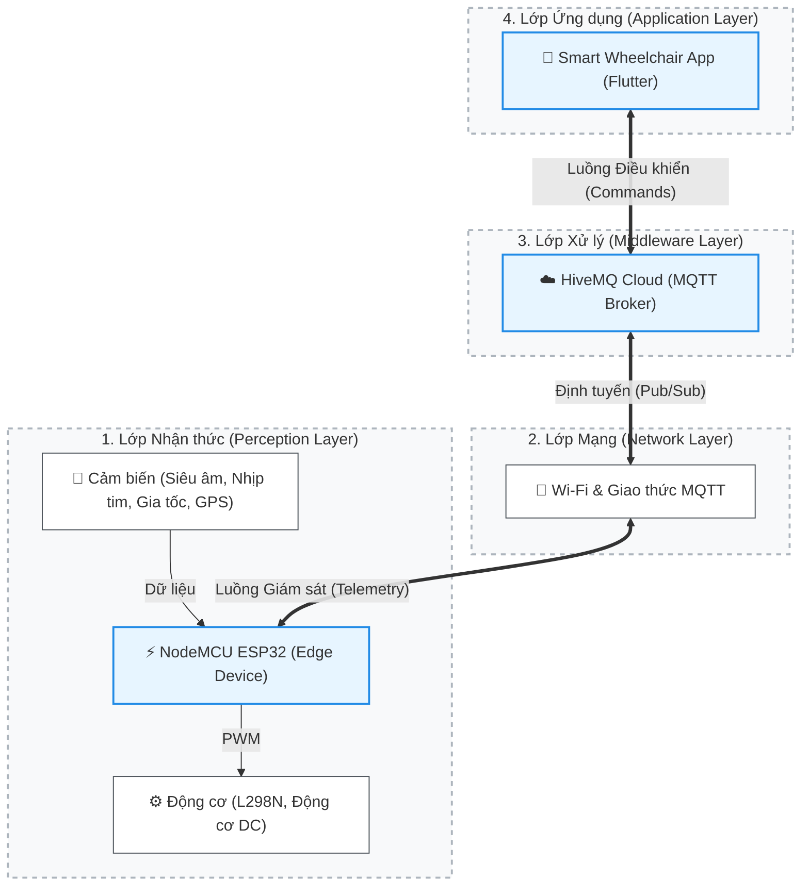

# 🏛️ Kiến trúc Hệ thống IoT — Smart Wheelchair

Dựa trên cấu trúc phần cứng, phần mềm và các giao thức giao tiếp đang được sử dụng, dự án **Smart Wheelchair** được xây dựng theo mô hình **Kiến trúc IoT 4 lớp (4-Layer IoT Architecture)**.

Mô hình 4 lớp này giúp phân tách rõ ràng trách nhiệm giữa việc thu thập dữ liệu vật lý, truyền tải mạng, điều phối luồng tin nhắn và tương tác với người dùng cuối, đảm bảo hệ thống hoạt động với độ trễ thấp (low latency) và khả năng mở rộng tốt (scalability).

## 📊 Sơ đồ Kiến trúc

---

## 🗂️ Chi tiết các Layer trong Kiến trúc

### 1. Lớp Nhận thức (Perception Layer / Edge Layer)
Đây là lớp tương tác trực tiếp với môi trường vật lý. Nhiệm vụ của lớp này là thu thập dữ liệu từ môi trường (thông qua cảm biến) và thực thi các hành động vật lý (thông qua cơ cấu chấp hành).

*   **Vi điều khiển trung tâm (Edge Device):** **NodeMCU ESP32**. Đóng vai trò là bộ não tại biên (edge node), đọc dữ liệu cảm biến và điều khiển động cơ.
*   **Cảm biến (Sensors):**
    *   `HC-SR04` (Siêu âm): Đo khoảng cách, phát hiện vật cản.
    *   `MAX30102`: Đo nhịp tim theo thời gian thực (real-time).
    *   `MPU6050`: Đo gia tốc và góc nghiêng, phục vụ tính năng cảnh báo té ngã (fall detection).
    *   `NEO-6M`: Module GPS để định vị vị trí xe lăn.
    *   `INMP441`: Microphone (I2S) để nhận diện lệnh giọng nói (voice commands).
    *   `Mạch chia áp`: Đo dung lượng pin thông qua ADC.
*   **Cơ cấu chấp hành (Actuators):**
    *   Module `L298N` và hệ thống **Động cơ DC** (DC Motors) để điều hướng chuyển động của xe lăn.

### 2. Lớp Mạng (Network Layer)
Lớp này chịu trách nhiệm truyền tải dữ liệu một cách an toàn và tin cậy giữa thiết bị phần cứng (ESP32) và máy chủ đám mây (Cloud).

*   **Kết nối Internet:** Sử dụng module **Wi-Fi** tích hợp sẵn trên ESP32.
*   **Giao thức truyền thông (Communication Protocol):** Hệ thống sử dụng **MQTT (Message Queuing Telemetry Transport)**. Đây là giao thức tối ưu cho IoT nhờ đặc tính gọn nhẹ, tiết kiệm băng thông và hỗ trợ mô hình Pub/Sub (Publish/Subscribe), đặc biệt quan trọng để điều khiển xe lăn theo thời gian thực.

### 3. Lớp Xử lý trung gian (Middleware Layer / Cloud Layer)
Đây là trạm trung chuyển trung tâm trên đám mây, làm nhiệm vụ phân phối, định tuyến (routing) hàng ngàn tin nhắn mỗi giây giữa thiết bị và ứng dụng mà không cần kết nối trực tiếp.

*   **MQTT Broker:** Dự án sử dụng **HiveMQ Cloud** làm máy chủ môi giới.
*   **Cơ chế hoạt động:** 
    *   **Telemetry:** ESP32 đóng vai trò là Publisher, đẩy (publish) dữ liệu cảm biến (JSON format) lên các topic của HiveMQ. App đóng vai trò Subscriber lắng nghe dữ liệu này.
    *   **Command:** App là Publisher đẩy lệnh điều khiển (tiến, lùi, trái, phải) xuống Broker. ESP32 là Subscriber lắng nghe các topic lệnh để kích hoạt động cơ.

### 4. Lớp Ứng dụng (Application Layer)
Đây là lớp trên cùng cung cấp giao diện trực quan, cho phép người dùng hoặc người thân giám sát và điều khiển hệ thống.

*   **Nền tảng:** Ứng dụng Mobile App đa nền tảng được phát triển bằng framework **Flutter** (Ngôn ngữ Dart).
*   **Giao diện & Chức năng (UI/UX & Features):**
    *   **Control Dashboard:** Giao diện điều khiển xe lăn (D-pad/Joystick).
    *   **Health Monitoring:** Biểu đồ hiển thị nhịp tim, thông báo SOS khi có cảnh báo nghiêng ngã (từ MPU6050) hoặc vật cản khẩn cấp.
    *   **Location Tracking:** Tích hợp Google Maps hiển thị vị trí theo thời gian thực (từ GPS NEO-6M).

---

## 🔄 Data Flow (Luồng dữ liệu kết nối Hệ thống)

Để hiểu rõ sự liên kết giữa Phần cứng, Phần mềm và Cloud, dưới đây là luồng dữ liệu (Data Flow) cụ thể:

### A. Luồng Điều khiển (Command Flow: App ➡️ Cloud ➡️ Hardware)
1. **[App]** Người dùng nhấn nút "Tiến lên" trên giao diện Flutter.
2. **[App]** Ứng dụng đóng gói lệnh thành chuỗi JSON (vd: `{"cmd": "forward"}`) và **Publish** lên HiveMQ Broker qua topic `wheelchair/control`.
3. **[Cloud]** **HiveMQ Broker** nhận tin nhắn và chuyển tiếp (route) ngay lập tức đến thiết bị đang theo dõi (Subscribe) topic đó.
4. **[Hardware]** **ESP32** nhận được JSON, giải mã (parse) và xuất tín hiệu PWM qua các chân GPIO kích hoạt **L298N** làm quay động cơ DC.

### B. Luồng Giám sát (Telemetry Flow: Hardware ➡️ Cloud ➡️ App)
1. **[Hardware]** Cảm biến (nhịp tim, siêu âm, GPS) thu thập dữ liệu vật lý liên tục.
2. **[Hardware]** **ESP32** tổng hợp dữ liệu, đóng gói thành định dạng JSON và **Publish** lên HiveMQ Broker qua các topic riêng biệt (vd: `wheelchair/sensors/heartrate`, `wheelchair/location`).
3. **[Cloud]** **HiveMQ Broker** đẩy dữ liệu về phía ứng dụng di động đang lắng nghe.
4. **[App]** Ứng dụng **Flutter** nhận dữ liệu, cập nhật lại trạng thái State (State Management) và render lại giao diện (cập nhật số đo nhịp tim, di chuyển marker trên Google Maps).
