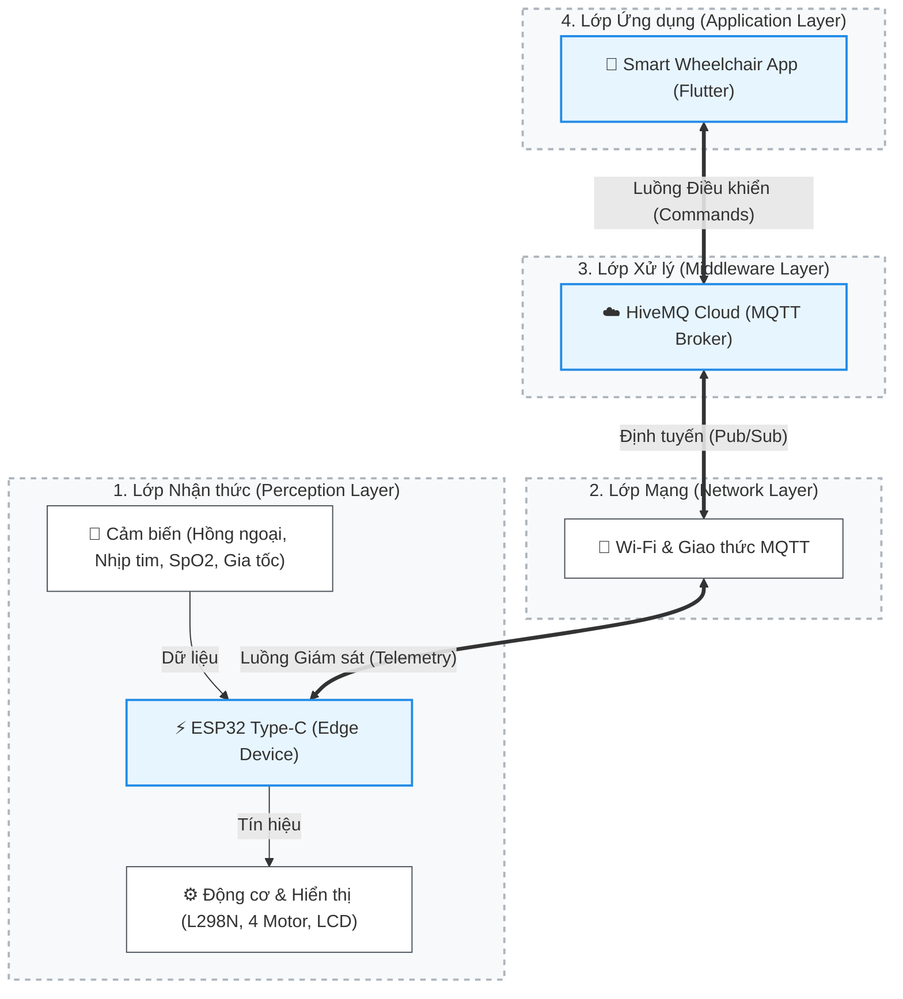

# 🦽 Smart Wheelchair - Dự án Xe lăn thông minh (IoT)

**Môn học:** Vạn Vật Kết Nối (IoT)  
**Lớp:** 252INOT231780_06  
**Nhóm:** Nhóm 7  
**Đề tài:** SMART WHEELCHAIR
---

## 📖 1. Giới thiệu dự án (Mô tả ứng dụng)

Dự án "Smart Wheelchair" là một hệ thống xe lăn thông minh ứng dụng công nghệ IoT nhằm hỗ trợ việc di chuyển và theo dõi sinh hiệu y tế cho người già và người khuyết tật.

Hệ thống cho phép người dùng hoặc người thân điều khiển xe lăn từ xa thông qua một ứng dụng di động (phát triển bằng Flutter) với độ trễ thấp nhờ giao thức MQTT. Bên cạnh đó, xe lăn được tích hợp cảm biến hồng ngoại để tự động dừng khi gặp vật cản hoặc bậc thang, cảm biến gia tốc phát hiện té ngã, cùng cảm biến theo dõi nhịp tim và nồng độ oxy trong máu (SpO2), đảm bảo an toàn tối đa cho người sử dụng.

## 👥 2. Thành viên nhóm

|  STT  | Họ và Tên       | MSSV     |
| :---: | --------------- | -------- |
|   1   | Võ Lê Vương     | 24110391 |
|   2   | Nguyễn Đức Phát | 24110296 |
|   3   | Nông Văn Cường  | 24110176 |

## 🛠 3. Công nghệ và Linh kiện sử dụng

### Phần cứng (Hardware)

* **Vi điều khiển trung tâm:** ESP32 Type-C (DevKitC).
* **Cơ cấu chấp hành & Hiển thị:** Khung xe mica trong suốt, 4 động cơ giảm tốc DC (TT Motor) màu vàng, Module điều khiển động cơ L298N, Màn hình LCD I2C.
* **Cảm biến:** 
  * 2 Cảm biến hồng ngoại (IR Sensor) để phát hiện vật cản và chống rơi (bậc thang).
  * Cảm biến gia tốc/góc nghiêng MPU6050 (GY-521) để phát hiện té ngã.
  * Cảm biến MAX30102 để theo dõi nhịp tim và SpO2.
* **Nguồn cấp:** 2 Pin 18650 Lishen xả cao 20A (2000mAh) cung cấp 7.4V, kết hợp mạch giảm áp (Step-down) xuống 5V để nuôi ESP32.

### Phần mềm & Kết nối (Software & Connectivity)

* **Firmware:** C++ trên PlatformIO.
* **Mobile App:** Framework Flutter (Ngôn ngữ Dart).
* **Giao thức:** MQTT (Broker: HiveMQ Cloud).
* **Định dạng dữ liệu:** JSON.

## 🏗️ 4. Kiến trúc Hệ thống

Dự án được xây dựng dựa trên **Kiến trúc IoT 4 lớp (4-Layer IoT Architecture)**, đảm bảo luồng dữ liệu hai chiều (điều khiển & giám sát) hoạt động với độ trễ thấp (low latency) và đáng tin cậy.

> **Lưu ý:** Xem chi tiết phân tích từng lớp chức năng và luồng dữ liệu (Data Flow) tại file [`KIENTRUC.md`](./docs/human/KIENTRUC.md).

## 🌟 5. Các tính năng chính (Features)

- **Điều khiển xe lăn từ xa**: Thông qua giao diện Joystick/D-pad trên ứng dụng. Hỗ trợ tùy chỉnh tốc độ linh hoạt để điều khiển 4 động cơ.
- **Dừng khẩn cấp tự động**: Sử dụng 2 cảm biến hồng ngoại để tự động nhận diện vật cản phía trước hoặc bậc thang nguy hiểm để phanh khẩn cấp.
- **Cảnh báo té ngã**: Phân tích góc nghiêng và gia tốc từ MPU6050, kích hoạt thông báo cảnh báo khi xe có dấu hiệu bị lật hoặc người dùng té ngã.
- **Theo dõi sinh hiệu (Health Monitoring)**: Liên tục đo nhịp tim và nồng độ oxy trong máu (SpO2) qua MAX30102, hiển thị trực tiếp lên màn hình LCD I2C và gửi về ứng dụng di động.
- **Kết nối kép WiFi + Bluetooth (BLE)**: Hỗ trợ hai phương thức kết nối — WiFi (MQTT qua HiveMQ Cloud) và Bluetooth Low Energy (BLE trực tiếp). Người dùng linh hoạt chọn phương thức kết nối phù hợp.
- **Đăng nhập & Lưu trữ đám mây**: Hỗ trợ đăng nhập Google và lưu trữ dữ liệu cá nhân hóa người dùng. Đang đồng bộ hóa hồ sơ với Firestore thay vì bộ nhớ tạm. Xem thêm tại [`TONGQUAN.md`](./docs/human/TONGQUAN.md).
