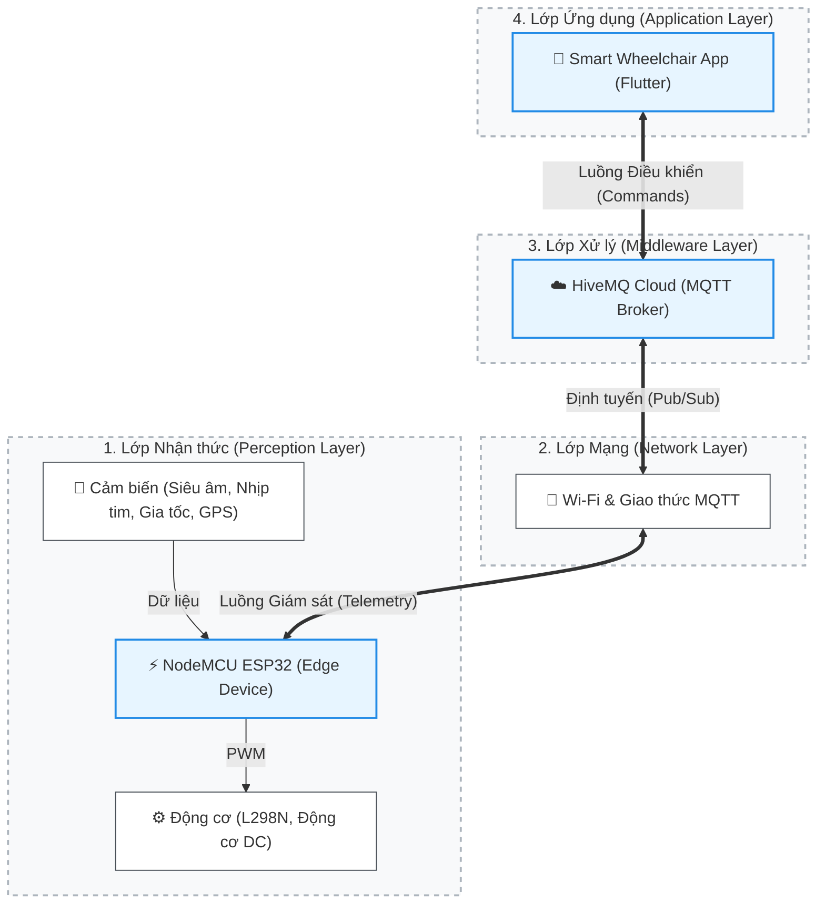

# 🦽 Smart Wheelchair - Dự án Xe lăn thông minh (IoT)

**Môn học:** Vạn Vật Kết Nối (IoT)  
**Lớp:** 252INOT231780_06  
**Nhóm:** Nhóm 7  
**Đề tài:** SMART WHEELCHAIR
---

## 📖 1. Giới thiệu dự án (Mô tả ứng dụng)

Dự án "Smart Wheelchair" là một hệ thống xe lăn thông minh ứng dụng công nghệ IoT nhằm hỗ trợ việc di chuyển và theo dõi an toàn cho người sử dụng.

Hệ thống cho phép người dùng hoặc người thân điều khiển xe lăn từ xa thông qua một ứng dụng di động (phát triển bằng Flutter) với độ trễ thấp nhờ giao thức MQTT. Bên cạnh đó, xe lăn được tích hợp cảm biến siêu âm để tự động phát hiện vật cản, hỗ trợ phanh khẩn cấp để đảm bảo an toàn tối đa.

## 👥 2. Thành viên nhóm

| STT | Họ và Tên | MSSV |
|:---:|---|---|
| 1 | Võ Lê Vương | 24110391 |
| 2 | Nguyễn Đức Phát | 24110296 |
| 3 | Nông Văn Cường | 24110176 |

## 🛠 3. Công nghệ và Linh kiện sử dụng

### Phần cứng (Hardware)

* **Vi điều khiển trung tâm:** NodeMCU ESP32 (Xử lý đa luồng, tích hợp Wi-Fi).
* **Cơ cấu chấp hành:** Động cơ giảm tốc DC & Module điều khiển động cơ L298N.
* **Cảm biến:** Cảm biến siêu âm HC-SR04 (Đo khoảng cách, tránh vật cản).
* **Nguồn cấp:** [Điền loại pin bạn dùng, VD: 2 Pin 18650 3.7V].

### Phần mềm & Kết nối (Software & Connectivity)

* **Firmware:** C++ trên Arduino IDE.
* **Mobile App:** Framework Flutter (Ngôn ngữ Dart).
* **Giao thức:** MQTT (Broker: HiveMQ Cloud).
* **Định dạng dữ liệu:** JSON.

## 🏗️ 4. Kiến trúc Hệ thống

Dự án được xây dựng dựa trên **Kiến trúc IoT 4 lớp (4-Layer IoT Architecture)**, đảm bảo luồng dữ liệu hai chiều (điều khiển & giám sát) hoạt động với độ trễ thấp (low latency) và đáng tin cậy.

> **Lưu ý:** Xem chi tiết phân tích từng lớp chức năng và luồng dữ liệu (Data Flow) tại file [`KIENTRUC.md`](./KIENTRUC.md).
